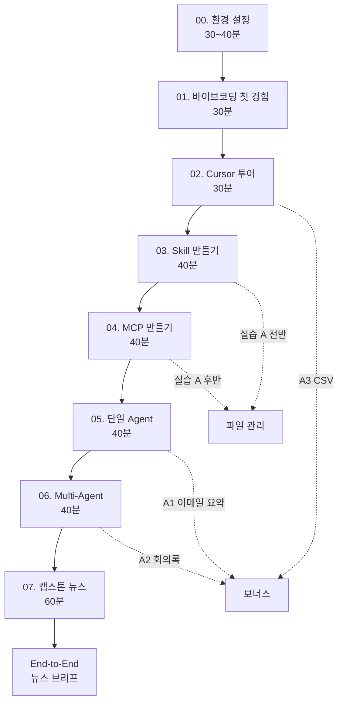

# 01. 바이브코딩 첫 경험

> "오늘 아침까지만 해도 '코드'라는 단어가 무서웠는데, 점심 먹기 전에 내 손으로 파일 하나를 만들고 있더라." 이 모듈이 끝나면 그 감각이 손에 남습니다.

## 이 모듈을 마치면

- 바이브코딩(Vibe Coding)의 개념과 전통 코딩과의 차이를 한 문장으로 말할 수 있습니다.
- Cursor에서 **Chat 창**에 질문을 던지고 답을 받는 감각을 익힙니다.
- **Tab 자동완성**으로 코드 몇 줄을 받아보는 경험을 합니다.
- Chat의 제안을 **Apply 버튼**으로 실제 파일에 반영하는 전 과정을 수행합니다.
- 오늘 4시간 로드맵(실습 A · 캡스톤 B · 보너스 A1~A3)을 머릿속에 그립니다.

## 사전 확인

모듈 00의 환경 점검 체크리스트 8개가 전부 `✅`이면 준비 완료입니다. 아직 `❌`가 있으면 모듈 00으로 돌아가세요. 특히 Cursor 실행만 되면 이번 모듈은 진행할 수 있습니다 (Gemini 키는 모듈 07 캡스톤에서 본격 사용).

## 오늘의 학습 규약 (Plan C)

본 강의는 **플랜 C**라는 약속 위에서 진행됩니다. 이 약속을 머리에 새기고 출발하면 중간에 헷갈리지 않습니다.

- **Cursor는 Free 플랜 + 내장 LLM**을 씁니다. 구독료 없이 오늘 실습 대부분이 돌아갑니다.
- **Gemini API는 Cursor 안에 꽂지 않습니다.** Cursor Free 플랜은 사용자 Gemini 키로 모델을 수동 선택(BYOK)하는 기능을 허용하지 않는다는 공식 제약 때문입니다.
- 대신 Gemini는 **별도 Python 스크립트**에서 직접 호출해봅니다 — 모듈 00에서 이미 첫 호출에 성공했죠.
- Cursor 기본 기능은 Cursor 내장 LLM으로, Gemini 호출이 필요한 실습은 Python 블록으로 분리해 진행합니다.

💡 "그럼 Cursor 안에서 Gemini를 쓰고 싶으면요?" — Cursor Pro 7일 트라이얼 동안만 체험 가능, 그 외에는 별도 스크립트·다른 클라이언트(Cline, Roo Code 등)에서 사용.

## 이론: "바이브코딩"이라는 말

### 전통 코딩 vs 바이브코딩

비유로 이해해봅시다.

| 구분 | 전통 코딩 | 바이브코딩(Vibe Coding) |
|------|-----------|-------------------------|
| 입력 | 문법적으로 정확한 코드 한 줄 한 줄 | 자연어로 의도 한 문단 |
| 역할 | 사람이 쓰고 컴퓨터가 실행 | 사람이 의도 → AI가 초안 → 사람이 감수 |
| 진행 | 에러 → 수정 → 에러 → 수정 | 대화 → 초안 → 빠른 시연 → 다음 요청 |
| 병목 | "문법 정확도" | "의도 정확도" |

중요한 것은 "AI가 대신 쓰는 것"이 아니라, **사람의 의도 → 자연어 지시 → AI의 초안 → 사람의 감수**라는 루프가 빨라졌다는 점입니다. 이 루프가 돌기 시작하면 비전공자도 결과물을 들고 다니기 시작합니다.

### 오늘 만날 4개의 키워드 지도

지금은 몰라도 됩니다. 비유만 머리에 넣어두세요.

1. **Skill(스킬)** — "특정 상황이 오면 펼치는 업무 매뉴얼 한 장"
2. **MCP** — "AI를 위한 USB-C, 어디에나 꽂는 표준 플러그"
3. **Agent(에이전트)** — "특정 업무를 맡긴 전담 비서 한 명"
4. **Multi-Agent(멀티에이전트)** — "비서들이 모인 작은 태스크포스"

### 수업의 두 축

- **실습 A (파일 관리)**: 모듈 03·04에서 Skill과 MCP를 한 세트로 만들어 "내 Downloads 폴더 정리해줘" 한 마디로 파일이 실제로 이동하는 경험을 합니다.
- **캡스톤 B (한·미 뉴스 멀티에이전트)**: 모듈 07에서 4개 Agent를 조합해 "반도체 수출 통제" 키워드로 한·미 매체 비교 브리프를 30분 안에 뽑아봅니다.

사이사이에 **보너스 A1~A3**(이메일/Slack 요약, 회의록 액션아이템, CSV 요약)이 배치됩니다.

### 성공을 가르는 마인드셋 3가지

- **작게 쪼개기**: "뉴스 멀티에이전트 만들기"가 아니라 "Gemini 응답을 터미널에서 한 줄 받기"부터.
- **바로 돌려보기**: 완벽해지면 돌리는 게 아니라, 돌려보고 고칩니다.
- **실패를 로그로 만들기**: 에러 메시지는 Google 검색 키워드이자 다음 힌트입니다.

## 실습 1: Cursor 첫 Chat — 안녕 Cursor

Cursor가 이미 설치돼 있다는 전제입니다. 모듈 00에서 설치했다면 바로 이어집니다.

### Step 1. 실습 폴더 열기

- **어디서**: Cursor 실행 상태에서 **File → Open Folder**
- **무엇을**: 모듈 00에서 만든 `C:\Users\<사용자>\vibe-1st` 선택
- **무엇을 기대**: 왼쪽 파일 트리에 `.venv`와 `hello.py`가 보입니다. 빈 프로젝트면 아무것도 없어도 OK.

💡 "폴더가 없어요" — PowerShell에서 `mkdir $env:USERPROFILE\vibe-1st` 실행 후 다시 열기.

### Step 2. Chat 창 열기

- **어디서**: Cursor 우측 사이드바, 또는 단축키 `Ctrl+L`
- **무엇을 기대**: 오른쪽 패널이 열리고 하단에 입력창이 뜹니다. 상단에 모드 드롭다운(기본값: Agent)이 보입니다.

이번 모듈에서는 기본 모드 그대로 두고 질문만 던져봅니다. 4개 모드의 자세한 차이는 모듈 02에서 다룹니다.

### Step 3. 첫 대화

- **무엇을 입력** (Chat 창 하단에 붙여넣기):

```
안녕, 내 이름은 OOO이야. 한 줄로 자기소개를 해줘. 존댓말로, 이모지 없이.
```

- **무엇을 기대**: 3~5초 안에 한 문장 답변. Free 플랜의 Auto 모드가 Cursor 내장 모델을 자동 선택합니다.

🎯 여기서 느낄 점: "Google 검색창에 말하듯 질문했는데 대답이 돌아온다." 이게 바이브코딩의 첫 감각입니다.

### Step 4. 한국어로 파이썬 개념 묻기

조금 더 교육적인 질문을 던져봅니다.

- **무엇을 입력**:

```
5살 아이에게 설명하듯, '파일'이 무엇인지 3문장으로 알려줘.
```

- **무엇을 기대**: 3문장 짜리 쉬운 설명. Cursor가 답하는 동안 상단에 "thinking..." 같은 상태 표시가 보이기도 합니다.

## 실습 2: Tab 자동완성 체험

Cursor의 **Tab 자동완성**은 입력 중인 코드의 "다음 줄"을 예측해주는 기능입니다. Cursor 전용 Fusion 모델이 이 작업을 담당합니다.

### Step 1. 새 파일 만들기

- **어디서**: Cursor 왼쪽 파일 트리 빈 공간 우클릭 → **New File**
- **무엇을 입력**: 파일 이름 `sample.py`로 저장

### Step 2. 첫 줄 입력

`sample.py` 파일 편집 창에서 다음 한 줄만 입력합니다.

```python
# 1부터 10까지 더해서 출력하는 코드
```

타이핑을 마치고 **Enter** 한 번 치고 잠시 기다립니다.

### Step 3. Tab 눌러 보기

몇 초 뒤에 회색으로 흐릿한 코드 제안이 떠오를 겁니다. 예:

```python
total = 0
for i in range(1, 11):
    total += i
print(total)
```

- **무엇을**: 회색 제안이 떠 있는 동안 **Tab 키**를 누르세요.
- **무엇을 기대**: 회색 글자가 검정색 "진짜 코드"로 확정됩니다. 이게 **Tab 자동완성** 동작입니다.

💡 제안이 안 뜨면 "한 줄 더 주석을 써보고" 같은 힌트를 주거나 엔터로 줄을 하나 더 내려보세요. Cursor는 맥락을 보고 예측합니다.

### Step 4. 실행해서 확인

PowerShell을 하나 열어서:

```powershell
cd $env:USERPROFILE\vibe-1st
python sample.py
```

- **무엇을 기대**: `55` 출력.

🎉 방금 여러분은 **한 줄의 주석**만 쓰고 나머지는 AI의 제안을 받았습니다. 이게 바이브코딩의 두 번째 감각입니다.

## 실습 3: Chat 제안을 Apply 버튼으로 파일에 반영

Chat 창에서 받은 답변 중에 "이 코드를 실제 파일에 넣어줘"라고 할 때 쓰는 게 **Apply 버튼**입니다. 파일 생성과 수정을 Chat에게 대신 시킬 수 있습니다.

### Step 1. `hello.md` 만들어 달라고 요청

- **어디서**: 오른쪽 Chat 창
- **무엇을 입력**:

```
현재 폴더에 `hello.md` 파일을 만들고, 안에 다음 내용을 마크다운으로 적어줘.
- 오늘 날짜 (2026-04-23)
- 내 이름 OOO
- "바이브코딩 첫 파일" 이라는 문구
목록(-) 형태로.
```

- **무엇을 기대**: Chat이 코드 블록으로 파일 내용을 보여주고, 블록 상단에 **"Apply"** 또는 **"Accept"** 버튼이 뜹니다. (Cursor 버전에 따라 이름이 조금 다릅니다.)

### Step 2. Apply 클릭

- **무엇을**: **Apply** 버튼 클릭
- **무엇을 기대**:
  - 왼쪽 파일 트리에 `hello.md`가 새로 생김
  - 에디터 가운데 영역에 변경 diff가 표시될 수 있음 → 추가로 **Accept**(또는 **Keep**) 클릭
  - 최종적으로 `hello.md`를 열면 내가 요청한 마크다운 내용이 들어 있음

### Step 3. 결과 확인

- 파일을 열어 내용이 기대와 일치하는지 눈으로 확인.
- 내용이 어긋나면 Chat 창에 "내용 중 날짜만 2026-04-24로 바꿔줘"처럼 **후속 요청**을 던지고 다시 Apply.

### 정리: 바이브코딩 첫 루프

방금 여러분이 거친 루프가 오늘 4시간의 축약판입니다.


- 의도를 자연어로 내놓고, 초안을 받고, 감수해서 반영. 이 작은 루프를 반복하면 모듈 07 캡스톤까지 갑니다.

## 모듈 로드맵 (4시간 전체)

오늘 전체 흐름을 한 번 더 정리합니다.



## 자주 막히는 지점

- **증상**: Chat 창을 여는 단축키가 동작하지 않는다.
  **해결**: 메뉴에서 **View → AI Chat** 또는 우측 상단 사이드바 아이콘으로 직접 열어보세요. 단축키는 Cursor 버전·키바인딩 프리셋(VS Code vs Vim)에 따라 다를 수 있습니다.

- **증상**: `You've run out of free requests` 메시지.
  **해결**: Cursor Free는 일일 Agent 요청 한도가 있습니다. 오늘 같은 날 너무 많이 쓰면 도달 가능. Chat 모드 위주로 아껴 쓰고, 다음 날 다시 시도. 실습 중엔 30회 이내로 목표.

- **증상**: Tab 제안이 아예 안 뜬다.
  **해결**: Cursor 우측 하단 상태바의 "Cursor Tab" 토글이 꺼져 있을 수 있음. 또는 방화벽이 Cursor 서버를 차단. 주석을 더 구체적으로 쓰면 제안 확률이 올라갑니다.

- **증상**: Apply를 눌러도 파일이 안 만들어진다.
  **해결**: Chat 응답의 **파일 경로가 명시**됐는지 확인. "`hello.md` 파일을"처럼 이름이 들어가야 Apply가 대상 파일을 찾습니다. 없으면 Chat에 "파일명은 `hello.md`로"라고 다시 알려주세요.

- **증상**: 한글 파일명 `안녕.md`로 만들었더니 터미널에서 깨진다.
  **해결**: 실습 파일은 **영문 소문자+하이픈**으로 이름짓는 습관을 들이세요. 오늘 모든 실습 폴더·파일명이 영어인 이유입니다. (한국어 콘텐츠는 파일 **안**에 쓰세요.)

## 핵심 요약

- 바이브코딩 = "자연어 의도 → AI 초안 → 사람 감수"의 빠른 루프.
- 오늘 첫 경험 3종: Chat 질문 / Tab 자동완성 / Apply로 파일 생성.
- 규약(Plan C): Cursor Free + 내장 LLM, Gemini는 별도 Python.

## 다음 모듈로 가기 전에 (체크리스트)

- [ ] Cursor에서 `vibe-1st` 폴더가 열려 있다
- [ ] Chat 창에서 한국어 질문·답변이 오고간다
- [ ] `sample.py`에 Tab 자동완성으로 코드 한 블록을 받았고, `python sample.py`가 `55`를 출력한다
- [ ] `hello.md`가 Apply로 생성됐고 내 이름이 들어 있다

## 슬라이드 요약

- 바이브코딩 = 자연어 의도를 AI에 던지고 초안을 받아 감수하는 루프.
- 오늘 세 손놀림: Chat 질문 / Tab 자동완성 / Apply 버튼.
- 규약(Plan C): Cursor Free + 내장 LLM, Gemini는 Python 터미널.
- 오늘 4시간 로드맵: M00 → M07. 실습 A(파일 관리)·캡스톤 B(뉴스 멀티) 두 축.
- 첫 성공 = `hello.md` 1장. 작게 쪼개고 바로 돌려봅니다.
