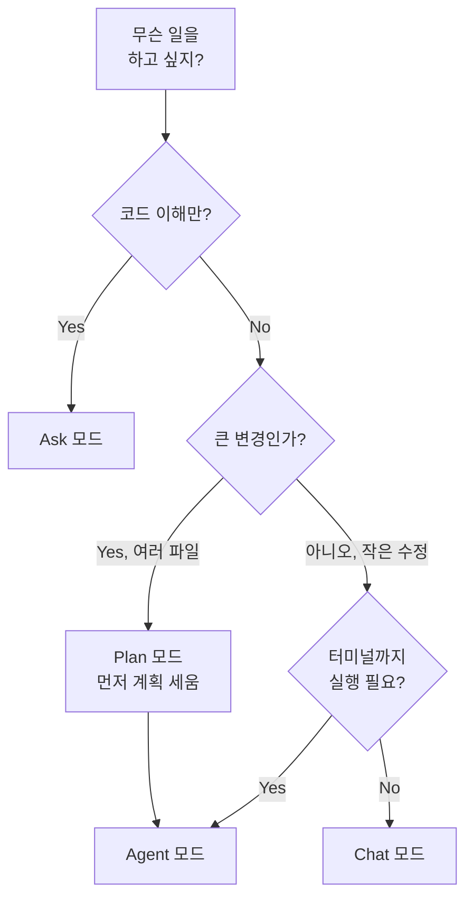

# 02. Cursor 핵심 기능 투어

> Cursor는 AI가 옆자리에 앉아서 같이 쓰는 에디터입니다. 방이 여러 개 있는데, 오늘 어느 방에서 어떤 일을 해야 효율이 나는지를 몸에 붙이는 모듈입니다.

## 이 모듈을 마치면

- Cursor **4개 모드(Chat / Ask / Agent / Plan)**의 쓰임을 구분해 설명할 수 있습니다.
- **Rules**(규칙)를 직접 등록해 답변 스타일을 고정할 수 있습니다.
- `@파일` `@폴더` 같은 컨텍스트 주입 문법을 몸에 익힙니다.
- (보너스 A3) CSV 한 장을 Cursor에게 넘겨 월별 합계 표를 받아봅니다.

## 이론: Cursor의 "방 배치도"

### Cursor 4 모드 비교표

Cursor의 채팅 창 상단에는 **모드 드롭다운**이 있습니다. 2026-04 기준 4가지 모드가 있고, 같은 질문을 던져도 모드에 따라 결과가 달라집니다. 용도를 구분합시다.

| 모드 | 파일 수정 자율성 | 대표 용도 | 20자 대화 예시 |
|------|------------------|-----------|------------------|
| **Chat** | ✅ 제안 위주, Apply로 반영 | 일상 대화, 질문·답변, 소규모 수정 | "이 함수 뭐 하는 거야?" |
| **Ask** | ❌ 읽기 전용 | 코드 이해·설명·리뷰 | "이 폴더 구조 설명해줘" |
| **Agent** | ✅ 자동 편집·터미널 실행 | 멀티파일 수정, 자율 실행 | "테스트 다 통과시켜줘" |
| **Plan** | ❌ 계획만 작성 (승인 후 실행) | 대규모 변경 사전 설계 | "리팩터링 계획 세워줘" |

> **각주**: 일부 Cursor 버전은 'Manual' 등 다른 이름으로 표시될 수 있습니다. 메뉴에서 원하는 동작을 찾아 사용하세요. (예컨대 공식 문서에는 'Manual'이라는 명칭이 남아 있지만, 학습자의 실제 화면에는 'Chat'으로 표시되기도 합니다.)

비유로 이해해봅시다.

- **Chat** = 옆자리 비서에게 귓속말로 묻기. 답을 받고 내가 Apply.
- **Ask** = "읽기만 하는 컨설턴트". 파일은 건드리지 않고 설명만.
- **Agent** = 비서에게 열쇠 꾸러미까지 맡기고 "알아서 저녁까지 차려놔".
- **Plan** = "먼저 계획서 가져와. 내가 승인하면 실행."

### 모드 전환 단축키

| 동작 | Windows / Linux | Mac |
|------|------------------|------|
| 새 채팅 열기 | `Ctrl + N` 또는 `Ctrl + R` | `Cmd + N` 또는 `Cmd + R` |
| 모드 메뉴 열기 (드롭다운) | `Ctrl + .` | `Cmd + .` |
| 모드 순환 (Chat↔Ask↔Agent↔Plan) | `Shift + Tab` (채팅 입력창에서) | `Shift + Tab` |
| 명령 팔레트 | `Ctrl + Shift + P` | `Cmd + Shift + P` |

💡 실습 내내 `Shift+Tab`으로 모드를 바꾸는 손버릇을 들이면 편합니다.

### 언제 어느 모드를 쓰나 — 한 장 플로우차트



### Rules (규칙) — 사내 규정집

**Rules**(공식 명칭, 구 "Rules for AI"는 레거시)는 Cursor가 **매 프롬프트마다 자동으로 읽는 지침**입니다. 비유하면 사내 규정집. "답변은 한국어로", "코드 블록에는 항상 설명을 붙여라" 같은 규칙을 한 번만 적어두면, 이후 모든 대화에 자동 반영됩니다.

- **저장 위치**
  - 프로젝트 규칙: 리포 루트의 `.cursor\rules\*.md` 또는 `*.mdc`
  - 사용자 전역 규칙: `Settings → Rules` (또는 `%USERPROFILE%\.cursor\rules\`)
  - 팀 규칙: Team/Enterprise 플랜 대시보드
- **파일 형식**: `.mdc`는 frontmatter를 지원해 적용 범위를 좁힐 수 있습니다.
- **레거시**: 프로젝트 루트의 `.cursorrules` 단일 파일도 아직 인식되지만, 신규 작업은 `.cursor\rules\` 디렉토리 방식을 권장.

`.mdc` frontmatter 예시:

```markdown
---
description: "TypeScript 파일 편집 시 적용되는 규칙"
alwaysApply: false
globs: ["**/*.ts", "**/*.tsx"]
---
- 모든 export 함수에는 JSDoc 주석을 붙인다.
- 에러 처리는 try/catch 대신 Result 타입을 선호한다.
```

### 컨텍스트 주입 3방법

- `@파일명` — 특정 파일의 내용을 프롬프트에 붙임. 예: `@README.md 이 문서 3줄 요약해줘`
- `@폴더명\` — 폴더 안 모든 파일을 한 번에 주입 (Windows 경로 구분자는 `\`지만 `@` 문맥에서는 둘 다 인식)
- `@URL` — 웹 문서 링크를 붙이면 Cursor가 가져와 컨텍스트로 씀

### 좋은 프롬프트 공식

4요소를 기억하세요. **역할 · 목표 · 제약 · 출력형식**.

> "너는 비전공자용 회계 도우미야(역할). 이 CSV에서 월별 매출 합계를 내되(목표), 단위는 원, 소수점 없이(제약), 마크다운 표로(출력형식) 보여줘."

### 공통 실패 패턴

- **모델 헷갈림**: Free 플랜 Auto 모드는 모델을 자동 선택. 성능이 안 나오면 "더 똑똑하게 생각해줘"가 아니라 **프롬프트를 구체화**하세요.
- **컨텍스트 초과**: `@`로 너무 많은 파일을 붙이면 앞부분이 잘려나갑니다. 꼭 필요한 파일만.
- **의도 흐려짐**: 여러 요청을 한 문장에 몰지 말고 "먼저 A, 확인되면 B"처럼 나눠서.

## 실습 1: 4개 모드 돌아보기 (15분)

### 준비물

- 모듈 01을 마친 상태 (Cursor 실행 가능, `hello.md` 있음, `vibe-1st` 폴더가 열려 있음)

### Step 1. Chat 모드 — `@파일` 요약 (작은 수정)

- **어디서**: Cursor Chat 창. 모드 드롭다운을 **Chat**으로.
- **무엇을 입력**:

```
@hello.md 이 파일 3줄로 요약해줘. 한국어 존댓말로.
```

- **무엇을 기대**: 3초 안에 3문장 요약이 돌아옵니다.

### Step 2. Ask 모드 — 폴더 구조 설명 (읽기 전용)

- **무엇을**: 모드 드롭다운 **Ask**로 변경 (또는 `Shift+Tab`)
- **무엇을 입력**:

```
@vibe-1st\ 이 폴더의 구조를 설명해줘. 어떤 파일들이 있고 각자 무슨 역할인지.
```

- **무엇을 기대**: 폴더 리스트 + 각 파일 설명. **파일 수정 제안은 나오지 않음** — Ask는 읽기 전용이라서 그렇습니다.

💡 Ask 모드의 강점: "내가 실수로 파일을 바꿀까 걱정 없이 물어볼 수 있다."

### Step 3. Agent 모드 — 폴더 한 번에 만들기

- **무엇을**: 모드를 **Agent**로
- **무엇을 입력**:

```
현재 프로젝트에 다음 폴더 구조를 만들어줘.
- docs\
- skills\
- mcp\
- agents\
각 폴더 안에는 빈 .gitkeep 파일 하나씩.
```

- **무엇을 기대**: Agent가 파일 생성 도구를 여러 번 호출. 실행 후 왼쪽 파일 트리에 4개 폴더가 생깁니다.

💡 이 폴더들이 앞으로 모듈 03~07에서 쓰입니다.

### Step 4. Plan 모드 — 먼저 계획서 받기

- **무엇을**: 모드를 **Plan**으로
- **무엇을 입력**:

```
이 프로젝트를 '한국어 뉴스 수집기'로 발전시키려고 해.
kr-news-agent, us-news-agent, fact-checker, orchestrator 4개 agent를 만들 건데
먼저 파일 구조와 각 agent의 책임을 담은 계획서를 `docs\plan.md`로 만들어줘.
```

- **무엇을 기대**: Plan 모드가 코드베이스를 **읽고** `docs\plan.md`에 계획서만 작성. "Build" 또는 "Execute" 버튼이 떠도 지금은 **누르지 말고** 파일 내용만 확인하세요.

💡 Plan 모드의 강점: 대규모 변경을 바로 실행하지 않고 "먼저 설계도를 본 뒤 승인"하는 안전장치입니다. 모듈 07 실습 B에서 이 패턴을 다시 씁니다.

## 실습 2: Rules 등록하기 (5분)

### Step 1. `ko-style.md` 규칙 만들기

- **어디서**: Agent 모드 Chat 창
- **무엇을 입력**:

```
.cursor\rules\ko-style.md 파일을 만들어줘.

---
description: "한국어 답변 스타일 규칙"
alwaysApply: true
---
- 모든 답변은 한국어 존댓말로 작성합니다.
- 코드 블록을 보여줄 때는 블록 아래 2~3줄로 한국어 해설을 붙입니다.
- 불필요한 사과/잡담은 생략합니다.
```

- **무엇을 기대**: `.cursor\rules\ko-style.md` 파일 생성.

### Step 2. 규칙 적용 확인

- **무엇을 입력** (Chat 모드):

```
for 루프 예시 하나 보여줘.
```

- **무엇을 기대**: 한국어 존댓말로 답변 + 코드 블록 아래 한국어 해설. 규칙이 적용된 증거입니다.

💡 규칙이 안 먹으면: frontmatter의 `alwaysApply: true`와 `.cursor\rules\` 경로를 다시 점검. Cursor 재시작으로도 해결되는 경우가 있습니다.

### 더 짧은 길: 기본 제공 `create-rule` 스킬

Cursor에는 `~/.cursor/skills-cursor/` 아래에 Rule·Skill·서브에이전트·Hook을 각각 만들어주는 **기본 제공 스킬 4종**이 번들되어 있습니다. 그 중 Rule용이 `create-rule`입니다. 위 Step 1에서 파일 내용을 직접 붙여 넣었지만, Agent 모드에서 자연어로 요청하면 `create-rule`이 알아서 `.mdc` frontmatter까지 붙인 파일을 만들어 줍니다.

| 기본 스킬 | 역할 | 이번 교육에서 언제 |
|----------|------|-------------------|
| `create-rule` | `.cursor\rules\<name>.mdc` 생성 | 이번 모듈 |
| `create-skill` | `~/.cursor/skills/<name>/SKILL.md` 생성 | 모듈 03 |
| `create-subagent` | `~/.cursor/agents/<name>.md` 생성 | 모듈 05 |
| `create-hook` | 자동 실행되는 훅 스크립트 생성 | 심화 주제 |

**실습:** Step 1을 다음 요청 한 줄로 대체해 봅니다.

```
ko-style 이라는 Rule 하나 만들어줘.
alwaysApply 는 true, 설명은 '한국어 답변 스타일'.
규칙: 모든 답변 한국어 존댓말, 코드 블록에 한국어 해설 2~3줄, 불필요한 사과 생략.
```

Agent 모드가 `create-rule`을 자동으로 호출해 `.mdc` 파일을 채워 줍니다. 결과를 열어 규칙 몇 줄만 내 스타일로 다듬으면 됩니다.

> ℹ️ 기본 제공 스킬은 Cursor 설치 시 `~/.cursor/skills-cursor/`에 함께 깔립니다. 이 경로가 보이지 않으면 Cursor 최신 버전으로 업데이트하세요.

## 실습 3 (보너스 A3): CSV 요약봇 (10분)

Cursor의 파일 컨텍스트 주입과 모드 조합을 CSV 분석에 써봅니다.

### Step 1. 샘플 CSV 만들기 (Agent 모드)

- **무엇을 입력**:

```
docs\sales-2026q1.csv 파일을 만들어줘. 컬럼은 date,product,amount.
2026-01-01부터 2026-03-31까지, 제품은 A/B/C 중 랜덤, amount는 10000~200000 사이 정수.
총 30행 만들어줘. 헤더 포함.
```

- **무엇을 기대**: 30행 CSV 생성.

### Step 2. 월별 합계 요청 (Chat 모드)

- **무엇을**: 모드를 **Chat**으로 변경 (분석만 할 거니까)
- **무엇을 입력**:

```
@docs\sales-2026q1.csv 이 파일을 보고 월별 매출 합계를 내줘.
- 단위: 원
- 천 단위 쉼표
- 결과는 마크다운 표로 (컬럼: 월, 합계)
- 계산 근거(어떻게 집계했는지)를 표 아래 한 문단으로.
```

- **무엇을 기대**: 3행 마크다운 표 + 설명. 숫자가 정확한지 **한 번 눈으로 검증**하는 습관을 들이세요 — Cursor 내장 LLM이 텍스트 추론만으로 답할 수도 있습니다.

### Step 3. (옵션) 같은 작업을 Gemini로 — Python 터미널

Cursor 없이 터미널에서도 같은 일을 시킬 수 있다는 걸 체감해봅니다.

`csv_summary_gemini.py`:

```python
import os, csv
from collections import defaultdict
from google import genai

# 1) CSV 읽기
totals = defaultdict(int)
with open("docs/sales-2026q1.csv", newline="", encoding="utf-8") as f:
    reader = csv.DictReader(f)
    for row in reader:
        month = row["date"][:7]  # YYYY-MM
        totals[month] += int(row["amount"])

# 2) Gemini에게 마크다운 표 요청
client = genai.Client(api_key=os.environ["GEMINI_API_KEY"])
prompt = f"""다음 월별 합계를 한국어 마크다운 표로 만들어줘.
단위는 원, 천 단위 쉼표. 컬럼은 '월', '합계'.
데이터: {dict(totals)}"""

resp = client.models.generate_content(
    model="gemini-2.5-flash",
    contents=prompt,
)
print(resp.text)
```

실행 (PowerShell, venv 활성화된 상태):

```powershell
cd $env:USERPROFILE\vibe-1st
python csv_summary_gemini.py
```

- **무엇을 기대**: 터미널에 월별 합계 표. "Cursor 안에서 한 일"과 "터미널에서 Gemini로 한 일"이 같은 결과를 냅니다 — 이게 오늘의 하이브리드 환경 감각입니다.

## Cursor 3대 상위 개념 미리보기

오늘 이후 모듈에서 본격 다루지만, Cursor는 아래 3개 상위 개념을 가집니다. 오늘은 이름만 기억하세요.

- **Rules** (방금 배움): 매 프롬프트에 자동 포함되는 규정집. `.cursor\rules\*.mdc`
- **Skills** (모듈 03): "특정 상황에 꺼내는 매뉴얼". `.cursor\skills\<이름>\SKILL.md`
- **Subagents** (모듈 05): "독립 실행 주체". `.cursor\agents\<이름>.md`
- **MCP** (모듈 04): "외부 도구 플러그인". `%USERPROFILE%\.cursor\mcp.json`

## 자주 막히는 지점

- **증상**: 모드 드롭다운에 "Chat"이 없고 "Manual"만 보인다.
  **해결**: 앞서 안내한 각주 — Cursor 버전에 따라 이름이 다를 수 있습니다. 행동(파일 편집 자율성)으로 구분하세요. 헷갈리면 **Agent / Ask / Plan** 3개만 구별해도 오늘 실습엔 충분합니다.

- **증상**: Agent 모드에서 폴더 생성을 시켰는데 파일 트리에 안 보인다.
  **해결**: 왼쪽 트리를 우클릭 → Refresh. 실제로는 만들어져 있고 새로고침 문제입니다.

- **증상**: `.cursor\rules\ko-style.md`를 만들었는데 영어 섞여 나온다.
  **해결**: 프론트매터의 `alwaysApply: true` 확인. 경로가 `.cursor\rules\` 안인지 확인. 여전히 안 먹으면 Cursor 재시작.

- **증상**: Chat에서 `@docs\` 폴더 참조했더니 응답이 엉뚱하다.
  **해결**: 폴더 파일이 너무 많거나 용량이 크면 컨텍스트가 잘립니다. 특정 파일 1~2개만 `@`로 붙이는 것이 정확합니다.

- **증상**: "You've run out of free Agent requests" 메시지.
  **해결**: Free 플랜은 Agent 요청 한도가 있습니다. 읽기·분석은 **Ask**나 **Chat**으로 돌리고, Agent는 꼭 필요할 때만.

- **증상**: Plan 모드가 계획서는 만들었는데 "Build" 버튼을 눌렀더니 엉뚱한 변경이 일어났다.
  **해결**: Plan 모드는 계획 → 실행 2단계입니다. **Build 전에 계획서를 반드시 눈으로 읽고** 납득이 되면 눌러야 합니다. 급하면 계획서에서 특정 섹션만 복사해 Agent 모드에 던지는 것도 안전합니다.

## 핵심 요약

- Cursor 4 모드: **Chat(귓속말)/Ask(읽기 전용 컨설턴트)/Agent(자율 실행)/Plan(계획 후 실행)**.
- **Rules**는 매 프롬프트에 자동 포함되는 사내 규정집. `.cursor\rules\*.mdc`.
- 컨텍스트 주입은 `@파일` 최소한만. 프롬프트는 역할·목표·제약·출력형식 4요소.

## 다음 모듈로 가기 전에 (체크리스트)

- [ ] `docs\`, `skills\`, `mcp\`, `agents\` 폴더가 생겼다
- [ ] `.cursor\rules\ko-style.md`가 적용된다 (한국어 존댓말 + 코드 해설)
- [ ] 4개 모드를 실제로 한 번씩 눌러봤다 (`Shift+Tab` 체험)
- [ ] (선택) CSV 요약 결과를 눈으로 검증했다

## 슬라이드 요약

- Cursor 4 모드: Chat / Ask / Agent / Plan. 행동 자율성 순서로 기억.
- 전환 단축키: `Shift+Tab`(순환), `Ctrl+.`(메뉴), `Ctrl+N`(새 채팅).
- Rules = 매 프롬프트에 자동 포함되는 사내 규정집. `.cursor\rules\*.mdc`.
- 컨텍스트 주입 `@파일` `@폴더` `@URL`. 과하게 붙이면 앞부분이 잘린다.
- 프롬프트 4요소: 역할·목표·제약·출력형식.
