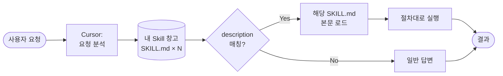
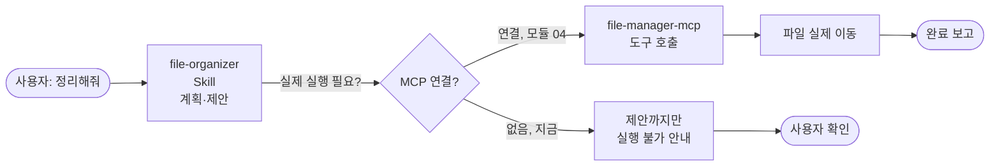

# 03. Skill 만들기 (실습 A 전반)

> 신입 비서에게 "언제 이 매뉴얼을 꺼내서 이렇게 일해주세요"라고 적어 서랍에 넣어두는 작업입니다. 이번 모듈은 "다운로드 폴더가 엉망이야"라는 말이 떨어지면 자동으로 펼쳐지는 매뉴얼 한 장을 만듭니다.

## 이 모듈을 마치면

- Skill(스킬)의 정의와 AI가 언제 Skill을 "발동"하는지 설명할 수 있습니다.
- `SKILL.md` frontmatter(name/description)가 왜 중요한지 이해합니다.
- **실습 A 전반부**: 파일 정리 Skill(`file-organizer`)을 **두 가지 방법**(수동·AI) 모두로 만듭니다.
- Skill 단독으로 되는 것과, MCP(모듈 04)가 붙어야 되는 것의 경계를 체감합니다.

## 이론: Skill이란

### Rules vs Skills — 항상 vs 필요할 때

모듈 02에서 만난 **Rules**는 "매 프롬프트에 자동으로 붙는 규정집"이었습니다. 반면 **Skill**은 "서랍에 넣어두고 특정 상황이 오면 꺼내는 매뉴얼"입니다. 차이는 **로드 시점**입니다.

| 항목 | Rules | Skills |
|------|-------|--------|
| 로드 시점 | 매번 자동 | 트리거될 때만 |
| 비용 | 매 요청마다 토큰 소모 | 평소엔 0, 쓸 때만 |
| 용도 | 스타일·일반 규정 | 특정 업무의 절차·체크리스트 |
| 파일 | `.cursor\rules\*.mdc` | `.cursor\skills\<이름>\SKILL.md` |

즉, Skill은 **컨텍스트를 아끼면서 전문화된 매뉴얼을 쌓아두는 방법**입니다. 10개의 Skill을 가지고 있어도, 쓰이지 않는 Skill의 내용은 매 프롬프트에 들어가지 않습니다.

### Skill의 동작 흐름



AI는 각 Skill의 **description**(설명문)만 먼저 보고, 사용자 요청과 맞는다 싶으면 해당 Skill의 본문을 로드합니다. 그래서 description은 "언제 이 매뉴얼을 꺼내야 하는지"를 **트리거 표현 위주**로 적어야 합니다.

좋은 description 예시:

> "Downloads 폴더 정리, 파일 이름 규칙화, 중복 파일 탐지 요청 시 트리거. '다운로드 정리해줘', '파일 이름 정리', '중복 지워줘' 발화에 반응."

나쁜 description 예시:

> "파일 관련 일반 작업을 도와주는 스킬입니다." ← 트리거 표현이 없어 AI가 언제 꺼낼지 판단 못함.

### Skill의 3요소

1. **명확한 트리거** — description에 발화 예시 2~3개 포함
2. **단계별 절차** — 1, 2, 3 번호를 매긴 step-by-step
3. **완료 기준** — "무엇을 보이면 끝"인지 체크리스트

### Skill 저장 위치 (공식 경로, Windows 기준)

| 종류 | Windows | macOS (보조) |
|------|---------|------|
| 프로젝트 Skill | `<project>\.cursor\skills\<이름>\SKILL.md` | `<project>/.cursor/skills/<이름>/SKILL.md` |
| 사용자 전역 Skill | `%USERPROFILE%\.cursor\skills\<이름>\SKILL.md` | `~/.cursor/skills/<이름>/SKILL.md` |

⚠️ **`/create-skill`은 Cursor 공식 슬래시 명령이 아닙니다.** 일부 커뮤니티 글에서 편의상 언급하지만 공식 기능이 아닙니다. 만드는 방법은 이번 모듈 뒤에서 두 가지로 나눠 설명합니다 — **방법 A: 수동**, **방법 B: AI에게 맡기기**.

### SKILL.md frontmatter 구조

```yaml
---
name: file-organizer           # 폴더명과 동일, 소문자/하이픈/숫자만
description: "Downloads 폴더 정리, 파일 이름 규칙화, 중복 탐지 요청 시 트리거"
license: MIT                   # (선택)
disable-model-invocation: false  # true면 slash command로만 실행
---
```

본문(프론트매터 아래)은 자유 형식 마크다운입니다. 번호 매긴 절차, 체크리스트, 예시 대화 등이 들어갑니다.

### 안티패턴 3가지

- **만능 Skill**: 트리거 범위가 "파일 관련 일반"처럼 너무 넓으면 AI가 언제 꺼낼지 몰라서 안 꺼냅니다.
- **트리거 누락**: description에 발화 예시가 없으면 발동이 안 됩니다.
- **단계 불명확**: "상황 봐서 정리해줘"처럼 애매하면 AI가 엉뚱한 해석을 합니다.

## 실습 A (전반): `file-organizer` Skill 만들기

### 시나리오

"내 컴퓨터의 `C:\Users\<사용자>\Downloads` 폴더가 엉망이다. 3개월치 자료가 뒤섞여 있다. 확장자별로 정리하고 중복 파일도 찾아줬으면 좋겠다."

이번 모듈에서는 **계획·제안 단계**까지만 다룹니다. 실제 파일 이동은 모듈 04에서 MCP가 붙어야 가능합니다. 이 경계를 느끼는 게 오늘의 핵심입니다.

### 준비물

- 모듈 02에서 만든 `vibe-1st` 폴더가 Cursor에 열려 있음
- 방금 모듈 02에서 만든 `skills\` 폴더
- **실습용 샘플 폴더**: 실제 Downloads를 건드리기 전에 연습용 폴더를 만들어 씁니다.

### Step 1. 실습용 샘플 폴더 준비

Cursor **Agent 모드**로:

```
downloads-demo\ 폴더를 만들고, 안에 아래 10개 빈 파일을 만들어줘.
- report_v1.pdf
- report_v2.pdf
- report_v2(1).pdf
- screenshot 2026-04-20.png
- screenshot 2026-04-21.png
- 견적서_최종.pdf
- 견적서_최종_최종.pdf
- data.csv
- data.xlsx
- memo.txt
내용은 모두 비워둬도 OK.
```

- **무엇을 기대**: `downloads-demo\` 폴더에 10개 빈 파일. 트리에서 확인.

💡 실제 `C:\Users\<사용자>\Downloads`에서 연습하고 싶다면 백업부터 한 뒤 진행하세요. 수업에서는 `downloads-demo\`로 시작합니다.

## 두 가지 만드는 방법

이제 본격적으로 Skill을 만듭니다. Cursor에서 Skill을 만드는 방법은 두 가지입니다. 수업에서는 **B부터 먼저 해보고**, 이해를 굳히기 위해 **A를 직접 찍어보는** 순서를 권합니다.

### 방법 A: 수동 작성

직접 파일을 만드는 방법입니다. 내부 구조를 정확히 이해하고 싶을 때 적합합니다.

#### A-1. 폴더와 파일 만들기

- **어디서**: PowerShell 또는 Cursor 파일 탐색기
- **무엇을 입력** (PowerShell):

```powershell
cd $env:USERPROFILE\vibe-1st
mkdir .cursor\skills\file-organizer -Force
New-Item .cursor\skills\file-organizer\SKILL.md -ItemType File
```

- **무엇을 기대**: `.cursor\skills\file-organizer\SKILL.md` 빈 파일 생성.

#### A-2. `SKILL.md` 내용 직접 붙여넣기

Cursor에서 `.cursor\skills\file-organizer\SKILL.md`를 열고 아래 내용을 **그대로** 붙여넣습니다.

````markdown
---
name: file-organizer
description: "Downloads 폴더 또는 임의 폴더의 정리, 파일 이름 규칙화, 중복 파일 탐지 요청 시 트리거. '다운로드 정리해줘', '파일 이름 정리', '중복 파일 찾아줘', '폴더 정리 도와줘' 발화에 반응."
license: MIT
---

# 파일 정리 Skill (file-organizer)

## 사용 시점

사용자가 특정 폴더를 정리하고 싶다는 요청을 보낼 때. 예:
- "내 Downloads 폴더 정리해줘"
- "이 폴더에서 중복 파일 찾아줘"
- "파일 이름을 규칙대로 바꿔줘"

## 절차 (반드시 순서대로)

1. **대상 폴더 확인**: 사용자가 어느 폴더를 정리할지 명시하지 않았다면, 먼저 물어본다.
   - 기본값 후보: `%USERPROFILE%\Downloads`, `%USERPROFILE%\Desktop`
   - 연습용: `downloads-demo\`
2. **폴더 스캔**: 파일 목록을 가져와 아래 정보를 보여준다.
   - 총 파일 수
   - 확장자별 분포 (pdf: 3개, png: 2개, 등)
   - 한글 파일명 / 영문 파일명 비율
3. **분류 제안**: 확장자 기준 하위 폴더로 이동하는 안을 마크다운 표로 보여준다.
   - pdf → `sorted\documents\`
   - png, jpg, jpeg, gif → `sorted\images\`
   - csv, xlsx → `sorted\spreadsheets\`
   - 그 외 → `sorted\misc\`
4. **중복 탐지**: 파일 이름이 거의 같은 그룹을 묶어 보여준다.
   - 예: `report_v1.pdf`, `report_v2.pdf`, `report_v2(1).pdf` → 동일 계열, "가장 최신(v2)만 보관" 제안
   - 예: `견적서_최종.pdf`, `견적서_최종_최종.pdf` → "최종_최종"이 더 최신일 가능성 표시
5. **이름 규칙화 제안**: 공백·특수문자·반복어미 정리안을 보여준다.
   - `screenshot 2026-04-20.png` → `screenshot-2026-04-20.png`
   - `견적서_최종_최종.pdf` → `견적서-2026-04-23-final.pdf`
6. **사용자 확인 요청**: "위 제안대로 실행해도 될까요? (Y/N)"를 반드시 묻고 **임의 실행하지 않는다**.
7. **실행 불가 안내**: 현 Skill은 실제 파일 이동을 직접 수행할 수 없다. MCP(`file-manager-mcp`) 연결 시 가능하다는 것을 안내한다. (모듈 04에서 이어짐)

## 네이밍 규칙

- 공백은 하이픈(`-`)으로 치환
- 한글 파일명은 유지 (Unicode 안전)
- 날짜는 `YYYY-MM-DD` 형식 권장
- "최종_최종", "(1)", "(2)" 같은 반복 꼬리표는 `-final` 또는 `-v2`로 정규화

## 완료 기준 (체크리스트)

- [ ] 대상 폴더 스캔 결과 요약 출력
- [ ] 분류 제안 표 출력
- [ ] 중복 그룹 목록 출력
- [ ] 이름 규칙화 제안 목록 출력
- [ ] 사용자 확인 프롬프트 출력
- [ ] 실행은 하지 않음 (Skill 단독일 때) / MCP 연결 시 실행까지

## 안 되는 것 (경계)

- 이 Skill은 **계획서 작성**까지만 한다. 실제 파일 이동/삭제/리네임은 `file-manager-mcp`(모듈 04)가 담당한다.
- 시스템 파일, 숨김 파일(`desktop.ini`, `Thumbs.db`)은 제안 대상에서 자동 제외한다.
````

저장 후 Cursor는 재시작할 필요 없이 다음 대화부터 이 Skill을 인식합니다.

#### A-3. 전역으로 복사 (선택)

이 Skill을 모든 프로젝트에서 재사용하고 싶다면:

```powershell
mkdir $env:USERPROFILE\.cursor\skills\file-organizer -Force
Copy-Item .cursor\skills\file-organizer\SKILL.md $env:USERPROFILE\.cursor\skills\file-organizer\
```

### 방법 B: AI에게 맡기기 (권장)

수업에서 대부분의 학습자는 이 방법을 씁니다. 자연어로 "Skill 만들어줘"라고 부탁하는 게 빠르고 실무적입니다.

#### B-1. Agent 모드로 요청

- **어디서**: Cursor **Agent 모드** (Chat 창에서 Shift+Tab으로 Agent 선택)
- **무엇을 입력**:

```
`%USERPROFILE%\.cursor\skills\file-organizer\SKILL.md` 경로에 파일 정리용 Skill을 만들어줘.

이 Skill은 "다운로드 폴더 정리해줘" 같은 요청이 오면 발동해야 해.
- frontmatter: name=file-organizer, description은 트리거 발화 예시 3개 이상 포함.
- 본문: 사용 시점 / 절차(6~7단계) / 네이밍 규칙 / 완료 기준 체크리스트 / 경계(이 Skill로 안 되는 것) 섹션 구성.
- 절차에는 확장자별 폴더 분류 제안, 중복 탐지, 이름 규칙화 제안, 사용자 확인 단계가 있어야 해.
- 실제 파일 이동은 이 Skill이 직접 하지 않고, MCP(file-manager-mcp)가 붙어야 가능하다는 걸 명시.

파일을 만들고, 어떤 섹션을 왜 넣었는지 3줄 요약해줘.
```

- **무엇을 기대**: Agent가 폴더를 만들고 `SKILL.md`를 생성. 3줄 요약도 출력. Apply/Accept 버튼을 눌러 최종 반영.

#### B-2. AI 산출물 검토 요령

AI가 만든 파일을 그대로 쓰면 안 됩니다. 아래 체크포인트로 **반드시 검토**하세요.

- [ ] `name`이 폴더명과 정확히 일치 (소문자·하이픈)
- [ ] `description`에 **발화 예시 2~3개** 들어 있음
- [ ] 절차에 "사용자 확인 단계"가 있음 (임의 실행 방지)
- [ ] "실행은 Skill 단독으로 불가, MCP 필요" 경계 명시
- [ ] Windows 경로(`\`) 표기 일관성. `/`가 섞여 있으면 수정

부족하면 Chat에 "발화 예시 한 개 더 추가해줘"처럼 후속 요청을 던지세요.

### 방법 C: 기본 제공 `create-skill` 스킬 사용 (가장 짧은 길)

Cursor를 설치하면 `~/.cursor/skills-cursor/` 경로에 **기본 제공 스킬 모음**이 함께 깔립니다. 그 중 하나가 `create-skill` 스킬입니다. Skill 뼈대를 만들 때 이 전용 스킬이 알아서 폴더·frontmatter·README·예시까지 채워 주기 때문에, 방법 B보다 한 단계 더 짧게 결과를 얻을 수 있습니다.

| 기본 제공 스킬 | 역할 | 대응 모듈 |
|---------------|------|----------|
| `create-skill` | 새 Skill(`SKILL.md` + 폴더)을 처음부터 만들기 | 이번 모듈 |
| `create-subagent` | 새 서브에이전트(`.cursor/agents/<name>.md`) 만들기 | 모듈 05 |
| `create-rule` | 새 Rule(`.cursor/rules/<name>.mdc`) 만들기 | 모듈 02 |
| `create-hook` | 자동 실행되는 훅 스크립트 만들기 | 심화 주제 |

**실습:** Cursor를 **Agent 모드**로 두고 다음과 같이 요청합니다.

```
file-organizer 라는 이름의 Skill 하나 만들어줘.
위치는 %USERPROFILE%\.cursor\skills\file-organizer\SKILL.md.
역할: 내 Downloads 폴더의 파일을 확장자별로 정리하는 규칙.
```

Agent 모드는 요청을 받으면 자동으로 `create-skill` 기본 스킬을 꺼내 씁니다. 결과로 폴더와 `SKILL.md`가 만들어지고, frontmatter·`description`·예시 섹션이 채워진 상태로 나옵니다. 내가 할 일은 "내 상황에 맞게 본문을 다듬는 것" 뿐입니다.

> ℹ️ `~/.cursor/skills-cursor/` 폴더가 보이지 않으면 Cursor를 최신 버전으로 업데이트하세요. Windows에선 `%USERPROFILE%\.cursor\skills-cursor\` 입니다.

### 언제 어느 걸 쓰나

- **구조를 확실히 이해하고 싶으면** → 방법 A (수동).
- **빠르게 결과를 보고 싶으면** → 방법 B (일반 AI 자연어).
- **가장 빠르게, 실수 없이 만들고 싶으면** → **방법 C (기본 제공 `create-skill` 스킬)**.
- **실무에서는** → 방법 C로 뼈대를 찍고 → 방법 A의 눈으로 한 번 읽어 다듬기.

💡 커뮤니티에서 자주 보이는 `/create-skill` **슬래시 명령**은 Cursor 공식 명령이 아닙니다. 반면 `~/.cursor/skills-cursor/create-skill/` **스킬**은 Cursor가 번들로 제공하는 실제 스킬입니다. 이름이 같아 혼동하기 쉬운데, "슬래시 명령이 아니라 스킬로 존재한다"고 기억하세요.

## Step 2. 트리거 테스트 — Skill 단독 동작 확인

Skill 파일을 만들었으니 실제로 트리거되는지 봅니다.

- **어디서**: Cursor **Chat 모드** (Agent가 아닌 Chat)
- **무엇을 입력**:

```
downloads-demo\ 폴더 정리해줘. 중복도 찾아주고 이름도 규칙대로 바꿔줘.
```

- **무엇을 기대**: Cursor가 `file-organizer` Skill을 인식하고 절차대로 분석 결과를 돌려줍니다.
  - 파일 10개 스캔 결과
  - 확장자별 분포
  - 분류 제안 표
  - 중복 그룹 (`report_v*`, `견적서_최종*`)
  - 이름 규칙화 제안
  - "실행해도 될까요?" 확인 프롬프트
  - "실제 이동은 MCP가 필요" 안내

Skill이 발동된 걸 어떻게 확인할까요? Cursor 3.x에서는 응답 상단에 "Used skill: file-organizer" 같은 배지가 표시됩니다. 표시가 없다면 description의 트리거 표현을 더 구체화하세요.

## Step 3. Skill ↔ MCP 관계 미리 그리기

모듈 04로 가기 전에 머릿속 모델을 하나 만듭시다.



- **Skill**: "어떻게 할지"의 매뉴얼 (판단·제안)
- **MCP**: "실제로 하는 손발" (실행)

Skill 단독 상태로는 `stop` 경로. 모듈 04에서 MCP를 붙이면 `tool → action` 경로가 열립니다.

## Step 4. 회고 — Skill만으로 되는 것과 안 되는 것

2분간 아래 두 문장을 완성해보세요.

- "Skill 단독으로 **되는 것**은 ___이다." (예: 분석, 제안, 계획, 체크리스트)
- "Skill 단독으로 **안 되는 것**은 ___이다." (예: 실제 파일 이동, 삭제, 리네임, 네트워크 호출)

이 차이가 다음 모듈의 MCP 동기입니다.

## Step 5. 산출물 체크

- [ ] `.cursor\skills\file-organizer\SKILL.md` 1개 생성됨
- [ ] 트리거 테스트에서 Skill 배지가 표시됨
- [ ] 분석·제안까지 나오고, 실제 파일 이동은 아직 안 된 상태 확인
- [ ] (선택) `%USERPROFILE%\.cursor\skills\file-organizer\`에도 복사됨

## 💡 Tip Box: Cursor Directory — 남의 Skill·Rule 가져다 쓰기

강의 중에 "좋은 Skill·Rule을 남이 만든 걸 가져다 쓸 수도 있나요?"라는 질문이 자주 나옵니다. 답은 **YES**입니다. 대표 리소스 두 곳을 소개합니다.

### (a) Cursor Directory (공식 커뮤니티 허브)

- URL: `https://cursor.directory/`
- Cursor 팀이 운영하는 Rules · MCP · Plugin 공유 사이트입니다. 로그인 없이 열람·복사 가능합니다.
- **설치 방법은 "복사-붙여넣기"가 공식입니다.** 별도 CLI 설치기는 없고, 웹에서 rule 내용을 복사 → 프로젝트 `.cursor\rules\<이름>.mdc` 또는 전역 `%USERPROFILE%\.cursor\rules\<이름>.mdc`에 저장하면 설치 완료.

### (b) awesome-cursorrules (커뮤니티)

- URL: `https://github.com/PatrickJS/awesome-cursorrules`
- 언어·프레임워크별 `.cursorrules` 모음. `git clone` 또는 raw 파일 다운로드 후 프로젝트로 복사.

### 표준 설치 절차

1. Rule/Skill 파일 확보 (`.mdc` 또는 `.md`)
2. `<project>\.cursor\rules\` 혹은 `%USERPROFILE%\.cursor\rules\` (또는 `skills\`)에 배치
3. Cursor 재로드 **불필요** — 다음 프롬프트부터 자동 적용

### 팀 공유 관행

- `.cursor\rules\` 디렉토리 **전체를 git에 커밋** → 팀원 전원이 동일한 rule 세트를 공유합니다.
- Skill도 마찬가지로 `.cursor\skills\`을 리포에 포함해 공유합니다.

⚠️ Cursor 자체 "install" 슬래시 명령은 존재하지 않습니다. "Directory에서 복사 → 내 경로에 붙여넣기"가 공식 방식입니다.

## 자주 막히는 지점

- **증상**: "다운로드 정리해줘"라고 했는데 Skill 배지가 안 뜨고 일반 답변만 온다.
  **해결**: description의 트리거 표현이 구체적인지 확인. "다운로드 정리해줘"라는 구어체 예시를 description에 넣으세요. Cursor는 description을 의미 매칭에 씁니다.

- **증상**: `name: file-organizer` 인데 폴더명은 `File-Organizer`라서 안 뜬다.
  **해결**: frontmatter의 `name`은 소문자/하이픈/숫자만. 폴더명과 **정확히 일치**해야 합니다. 대소문자도 동일하게.

- **증상**: SKILL.md를 수정했는데 변경이 반영 안 된다.
  **해결**: Cursor를 완전히 종료했다가 다시 열어보세요. Skill 로딩은 보통 자동이지만 드물게 캐시가 남습니다.

- **증상**: "실행은 하지 않음"이라고 적었는데도 Cursor가 파일을 이동해버린다.
  **해결**: Cursor Chat은 기본 파일 시스템 쓰기 권한이 제한적이지만, Agent 모드에서는 있습니다. SKILL.md에 "사용자 확인 없이 실행하지 말 것"을 강조하고, 테스트는 **Chat 모드**로만.

- **증상**: 여러 Skill을 만들었는데 AI가 자꾸 엉뚱한 Skill을 불러온다.
  **해결**: description들이 겹치거나 너무 일반적이면 오분류가 납니다. 각 Skill의 트리거 표현을 서로 배타적으로 다듬으세요.

- **증상**: Windows 탐색기에서 `.cursor` 폴더가 만들어지지 않는다 ("파일 이름을 입력해야 합니다" 에러).
  **해결**: 탐색기는 `.`으로 시작하는 이름을 거부합니다. 끝에 점을 하나 더 붙여 `.cursor.`로 입력 후 Enter (자동 trim됨). 또는 PowerShell에서 `mkdir .cursor` 추천.

## 핵심 요약

- Skill = "특정 상황이 오면 펼치는 업무 매뉴얼". Rules와 달리 **필요할 때만 로드**됩니다.
- 좋은 Skill의 3요소: 트리거·절차·완료 기준.
- 만드는 법 2가지: **수동(A)** + **AI에게 맡기기(B)**. `/create-skill`은 공식 아님.
- Skill은 "판단·계획"까지, "실제 실행"은 MCP의 몫 → 모듈 04로.

## 다음 모듈로 가기 전에 (체크리스트)

- [ ] `.cursor\skills\file-organizer\SKILL.md` 생성 완료
- [ ] Skill 트리거로 분석·제안이 출력된다
- [ ] 실제 파일 이동은 "안 되는 것"으로 명시된 상태
- [ ] "Skill만으로 부족한 부분 = MCP 필요"를 한 문장으로 말할 수 있다

## 슬라이드 요약

- Skill = 필요할 때만 꺼내는 매뉴얼. Rules는 항상 켜진 규정집.
- description의 트리거 표현이 Skill의 심장. 발화 예시 2~3개 포함.
- 3요소: 트리거·단계별 절차·완료 기준.
- 만드는 법 2가지: 수동(A) + AI(B). `/create-skill`은 공식 아님.
- Skill은 "판단·계획"까지, "실제 실행"은 MCP의 몫 → 모듈 04로.
