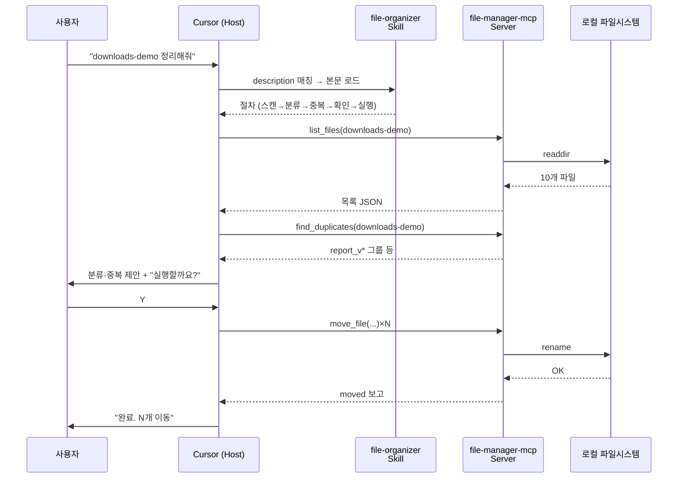

# 04. MCP 만들기와 등록 (실습 A 후반)

> 모듈 03에서 "매뉴얼은 있는데 실제 손발이 없다"는 답답함을 겪었습니다. 이번에는 AI에게 **손과 발**을 붙여줍니다. USB-C 포트를 생각하세요 — 어떤 에디터에 꽂아도 같은 도구가 쓰입니다.

## 이 모듈을 마치면

- MCP(Model Context Protocol)의 구조(Host · Client · Server · Tools)를 한 장 그림으로 설명합니다.
- Skill과 MCP의 결정적 차이("지식 vs 실행권")를 체감합니다.
- **실습 A 후반부**: 파일 관리 MCP 서버(`file-manager-mcp`)를 **두 가지 방법**(수동·AI)으로 만듭니다.
- 모듈 03의 Skill이 이번 모듈의 MCP 도구를 "불러 쓰는" 통합 흐름을 관찰합니다.

## 이론: MCP란

### MCP의 한 줄 정의

**MCP (Model Context Protocol)**는 AI가 외부 능력(도구·데이터·프롬프트 템플릿)을 써야 할 때 따르는 **표준 규격**입니다. 현재 최신 스펙 날짜는 `2025-11-25`입니다 (MCP는 날짜 기반 버전 표기를 씁니다).

**USB-C 비유**: 예전에는 AI 클라이언트마다 "파일 읽기", "웹 호출", "DB 접근" 기능을 따로따로 붙여야 했습니다. 이제는 MCP라는 포트 하나에 맞춰 서버를 만들면, Cursor·Claude Desktop·Cline 등 어디에 꽂아도 똑같이 씁니다.

### MCP 3대 구성요소 — 다이어그램

```mermaid
flowchart LR
  host([Host<br/>Cursor 등]):::host -.JSON-RPC 2.0.-> client[Client<br/>내장 커넥터]:::client
  client <-.-> server[Server<br/>능력 제공]:::server
  server --> tools[Tools<br/>실행 함수]:::tools
  server --> res[Resources<br/>참조 데이터]:::res
  server --> prompts[Prompts<br/>템플릿]:::prompts
  classDef host fill:#2563eb,stroke:#1e40af,color:#fff
  classDef client fill:#7c3aed,stroke:#5b21b6,color:#fff
  classDef server fill:#16a34a,stroke:#166534,color:#fff
  classDef tools fill:#f59e0b,stroke:#b45309,color:#000
  classDef res fill:#0ea5e9,stroke:#075985,color:#fff
  classDef prompts fill:#ef4444,stroke:#991b1b,color:#fff
```

- **Host**: LLM 앱 자체. Cursor, Claude Desktop, Cline 등.
- **Client**: Host 안에 내장된 커넥터. 우리가 직접 건드릴 일은 거의 없습니다.
- **Server**: 우리가 만들거나 가져오는 쪽. 능력을 제공합니다.
- **Tools**: 모델이 실제로 실행할 함수. 예: `list_files(dir)`, `move_file(src, dst)`.
- **Resources**: 모델/사용자가 참조할 데이터. 예: 특정 디렉터리의 파일 목록.
- **Prompts**: 템플릿화된 메시지/워크플로우.

### Transport — 서버와 어떻게 통신하나

- **stdio**: 로컬 프로세스 간 표준 입출력 통신. **가장 쉽고 학습·로컬 실습용**. 오늘 우리가 쓸 방식.
- **Streamable HTTP**: 원격 서버 통신의 권장 방식 (2025-11-25 스펙 정식 채택).
- **SSE**: 일부 호환성용. 신규 구현은 Streamable HTTP 권장.

### Skill vs MCP — 한 문장으로

- **Skill**: "이 상황이 오면 이렇게 해주세요"라는 **매뉴얼** (지식/절차)
- **MCP**: "이 일을 실제로 해낼 수 있는 **도구**" (손과 발)

Skill만 있으면 계획서까지 나옵니다. MCP가 연결되면 **실행**까지 갑니다. 이게 모듈 03 끝의 답답함을 풀어주는 열쇠입니다.

### Cursor의 MCP 등록 위치 (Windows 기준)

| 종류 | Windows | macOS (보조) |
|------|---------|------|
| 전역 MCP 설정 | `%USERPROFILE%\.cursor\mcp.json` | `~/.cursor/mcp.json` |
| 프로젝트 MCP 설정 | `<project>\.cursor\mcp.json` | `<project>/.cursor/mcp.json` |

- **동명 서버 시**: 프로젝트 쪽이 우선.
- UI 접근: `Settings → Add new global MCP server` 버튼이 기본 에디터로 `mcp.json`을 열어줍니다.

#### mcp.json 표준 구조 (stdio 로컬)

```json
{
  "mcpServers": {
    "file-manager-mcp": {
      "command": "node",
      "args": [
        "C:\\Users\\me\\vibe-1st\\mcp\\file-manager-mcp\\server.js",
        "C:\\Users\\me\\vibe-1st"
      ]
    }
  }
}
```

⚠️ JSON 안에서는 **백슬래시 두 개**(`\\`)로 이스케이프하거나 슬래시(`/`)를 써야 합니다. `C:\Users\me` 그대로 쓰면 파싱 에러.

## 실습 A (후반): `file-manager-mcp` 서버 만들기

### 준비물

- 모듈 03의 `downloads-demo\`와 `.cursor\skills\file-organizer\SKILL.md`
- **Node.js LTS** (모듈 00에서 설치 완료). `node -v`로 재확인.
- 빈 `mcp\` 폴더 (모듈 02에서 만듦)

## 두 가지 만드는 방법

### 방법 A: 수동 작성 (구조 학습용)

SDK를 직접 설치하고 코드를 붙여넣는 고전적 방법입니다.

#### A-1. 패키지 초기화

- **어디서**: PowerShell
- **무엇을 입력**:

```powershell
cd $env:USERPROFILE\vibe-1st
mkdir mcp\file-manager-mcp -Force
cd mcp\file-manager-mcp

npm init -y
npm install @modelcontextprotocol/sdk
```

- **무엇을 기대**: `package.json`과 `node_modules\`가 생깁니다.

#### A-2. `package.json`에 `"type": "module"` 추가

`package.json`을 Cursor로 열어 최상단에 `"type": "module"`을 추가합니다.

```json
{
  "name": "file-manager-mcp",
  "version": "0.1.0",
  "type": "module",
  "main": "server.js",
  "dependencies": {
    "@modelcontextprotocol/sdk": "^x.y.z"
  }
}
```

#### A-3. `server.js` 작성

`mcp\file-manager-mcp\server.js` 파일을 만들고 아래 코드를 **그대로** 붙여넣으세요.

```javascript
// mcp/file-manager-mcp/server.js
// 파일 관리 MCP 서버 (stdio transport).
// 제공 툴: list_files, move_file, find_duplicates

import { Server } from "@modelcontextprotocol/sdk/server/index.js";
import { StdioServerTransport } from "@modelcontextprotocol/sdk/server/stdio.js";
import {
  CallToolRequestSchema,
  ListToolsRequestSchema,
} from "@modelcontextprotocol/sdk/types.js";
import fs from "node:fs/promises";
import path from "node:path";

// 허용 루트 디렉토리 (보안상 여기 밖으로는 접근 불가)
const ALLOWED_ROOT = process.argv[2] || process.cwd();

function ensureInsideRoot(target) {
  const abs = path.resolve(target);
  if (!abs.startsWith(path.resolve(ALLOWED_ROOT))) {
    throw new Error(`Access denied: ${abs} is outside ${ALLOWED_ROOT}`);
  }
  return abs;
}

async function listFiles(dir) {
  const abs = ensureInsideRoot(dir);
  const entries = await fs.readdir(abs, { withFileTypes: true });
  return entries.map((e) => ({
    name: e.name,
    isDir: e.isDirectory(),
    path: path.join(abs, e.name),
  }));
}

async function moveFile(src, dst) {
  const absSrc = ensureInsideRoot(src);
  const absDst = ensureInsideRoot(dst);
  await fs.mkdir(path.dirname(absDst), { recursive: true });
  await fs.rename(absSrc, absDst);
  return { moved: true, from: absSrc, to: absDst };
}

async function findDuplicates(dir) {
  const abs = ensureInsideRoot(dir);
  const entries = await fs.readdir(abs, { withFileTypes: true });
  const groups = {};
  for (const e of entries) {
    if (!e.isFile()) continue;
    // 파일명 정규화: 공백, (1), _최종, v1/v2 같은 꼬리표 제거
    const base = e.name
      .toLowerCase()
      .replace(/\s+/g, "")
      .replace(/\(\d+\)/g, "")
      .replace(/_?최종/g, "")
      .replace(/_?v\d+/g, "")
      .replace(/\.[^.]+$/, ""); // 확장자 제거
    (groups[base] ||= []).push(e.name);
  }
  return Object.entries(groups)
    .filter(([, names]) => names.length > 1)
    .map(([base, names]) => ({ base, names }));
}

const server = new Server(
  { name: "file-manager-mcp", version: "0.1.0" },
  { capabilities: { tools: {} } }
);

server.setRequestHandler(ListToolsRequestSchema, async () => ({
  tools: [
    {
      name: "list_files",
      description: "지정 폴더의 파일·폴더 목록을 반환합니다.",
      inputSchema: {
        type: "object",
        properties: { dir: { type: "string" } },
        required: ["dir"],
      },
    },
    {
      name: "move_file",
      description: "파일을 src에서 dst로 이동합니다. 중간 폴더는 자동 생성.",
      inputSchema: {
        type: "object",
        properties: {
          src: { type: "string" },
          dst: { type: "string" },
        },
        required: ["src", "dst"],
      },
    },
    {
      name: "find_duplicates",
      description: "이름 패턴이 비슷한 중복 파일 그룹을 탐지합니다.",
      inputSchema: {
        type: "object",
        properties: { dir: { type: "string" } },
        required: ["dir"],
      },
    },
  ],
}));

server.setRequestHandler(CallToolRequestSchema, async (req) => {
  const { name, arguments: args } = req.params;
  let result;
  try {
    if (name === "list_files") result = await listFiles(args.dir);
    else if (name === "move_file") result = await moveFile(args.src, args.dst);
    else if (name === "find_duplicates") result = await findDuplicates(args.dir);
    else throw new Error(`Unknown tool: ${name}`);
    return { content: [{ type: "text", text: JSON.stringify(result, null, 2) }] };
  } catch (err) {
    return {
      isError: true,
      content: [{ type: "text", text: `Error: ${err.message}` }],
    };
  }
});

const transport = new StdioServerTransport();
await server.connect(transport);
console.error(`[file-manager-mcp] listening on stdio. root=${ALLOWED_ROOT}`);
```

💡 `console.error`로 로그를 찍는 이유: stdio 서버는 **표준 출력(stdout)**을 JSON-RPC 메시지 전용으로 씁니다. 디버깅 로그는 반드시 **표준 에러(stderr)**로.

#### A-4. 로컬 구동 테스트 (dry run)

- **어디서**: PowerShell
- **무엇을 입력**:

```powershell
cd $env:USERPROFILE\vibe-1st
node mcp\file-manager-mcp\server.js .\downloads-demo
```

- **무엇을 기대**: stderr에 `[file-manager-mcp] listening on stdio. root=...\downloads-demo` 가 찍히고 프로세스가 대기 상태. `Ctrl+C`로 종료.

정상 종료되면 서버가 "살아있는" 겁니다. 실제 테스트는 Cursor가 메시지를 보내야 가능합니다.

### 방법 B: AI에게 맡기기 (권장)

Agent 모드로 한 번에 요청합니다.

#### B-1. Agent 모드로 요청

- **어디서**: Cursor **Agent 모드**
- **무엇을 입력**:

```
mcp\file-manager-mcp\ 폴더를 만들고 MCP 서버 1개를 구현해줘.

요구사항:
- TypeScript 대신 JavaScript (ESM). package.json에 "type": "module".
- @modelcontextprotocol/sdk를 npm install로 추가.
- stdio transport.
- 제공 tool 3개: list_files(dir), move_file(src, dst), find_duplicates(dir).
- ALLOWED_ROOT를 첫 번째 CLI 인자로 받고, 그 밖의 경로는 차단.
- 로그는 console.error로만 (stdio 서버 필수 규칙).
- 윈도우 경로 호환 (path.resolve 사용).

완료 후 파일 목록(server.js, package.json)과 실행 명령을 보여줘.
```

- **무엇을 기대**: Agent가 폴더·파일 생성, 의존성 설치 명령 실행, 코드 작성. Terminal 탭에서 `npm install` 진행도 보입니다.

#### B-2. AI 산출물 검토 체크리스트

- [ ] `package.json`에 `"type": "module"` 있음
- [ ] `server.js`가 `process.argv[2]`를 ALLOWED_ROOT로 읽음
- [ ] `ensureInsideRoot()` 같은 경로 검증 함수 있음
- [ ] `console.error`로만 로깅 (`console.log` 금지)
- [ ] `list_files`, `move_file`, `find_duplicates` 3개 툴 선언
- [ ] 허용 루트 밖 접근 시 에러 반환

부족하면 "ensureInsideRoot 보안 체크를 추가해줘"처럼 후속 요청.

### 언제 어느 걸

| 상황 | 추천 방법 |
|------|----------|
| MCP 구조를 처음 배울 때 | A (수동). SDK 함수·스키마를 직접 봐야 이해됨 |
| 프로토타입이 급할 때 | B (AI 자연어). 30초 만에 초안 |
| 실무에서 확장 중 | B로 뼈대 + A의 눈으로 검토·보강 |

### 참고: 기본 제공 스킬은 MCP 생성용이 없다

모듈 02·03·05에서 본 `create-rule` / `create-skill` / `create-subagent` / `create-hook` 4종은 **Rule·Skill·서브에이전트·Hook 생성 전용**입니다. MCP **서버 코드** 자체를 만드는 기본 제공 스킬은 없습니다.

대신 방법 B(자연어)로 Agent 모드에 요청하면 Cursor가 직접 TypeScript/Python 프로젝트를 만들어 줍니다. 예:

```
TypeScript로 파일 관리 MCP 서버 만들어줘.
위치 mcp\file-manager-mcp\. 도구 4개: list_files, move_file, rename_file, find_duplicates.
안전하게 사용자 루트 밖 접근 차단 포함. package.json + index.ts + README 한 세트로.
```

💡 `~/.cursor/skills-cursor/`에 들어있는 "create-X" 이름의 4종은 **Cursor가 번들로 제공하는 Skill**입니다. 이름이 비슷한 `/create-skill` **슬래시 명령**과는 다른 개념이니 헷갈리지 마세요 — 공식 슬래시 명령은 없고, 기본 스킬이 있을 뿐입니다.

## Step 1. Cursor에 등록

서버 코드(A 또는 B로 만든 것)를 Cursor에 등록합니다.

- **어디서**: Cursor → `Settings → Add new global MCP server` (또는 `%USERPROFILE%\.cursor\mcp.json` 직접 열기)
- **무엇을 입력**:

```json
{
  "mcpServers": {
    "file-manager-mcp": {
      "command": "node",
      "args": [
        "C:\\Users\\me\\vibe-1st\\mcp\\file-manager-mcp\\server.js",
        "C:\\Users\\me\\vibe-1st\\downloads-demo"
      ]
    }
  }
}
```

⚠️ `me` 자리에 **내 실제 Windows 사용자명**을 넣으세요. PowerShell에서 `echo $env:USERPROFILE`로 확인 가능.

저장 후 Cursor를 **재시작**합니다.

## Step 2. 등록 확인

- **어디서**: Cursor → Settings → MCP Servers 패널
- **무엇을 기대**: `file-manager-mcp` 서버가 초록색(정상) 상태. 아래에 Tool 목록(`list_files`, `move_file`, `find_duplicates`) 3개가 보여야 합니다.

빨간색이면 아래 트러블슈팅으로 가세요.

## Step 3. Skill + MCP 통합 실행 (마법의 순간)

이제 모듈 03의 Skill이 이번 MCP의 tool을 **불러다 씁니다**.



- **어디서**: Cursor Chat 모드
- **무엇을 입력**:

```
downloads-demo\ 폴더 정리해줘.
중복도 찾아주고, 확장자별로 정리된 하위 폴더로 실제로 옮겨줘.
```

- **무엇을 기대**:
  - `file-organizer` Skill 배지 표시
  - Cursor가 `list_files` 호출 → 파일 10개 목록 획득
  - `find_duplicates` 호출 → `report_v*` 그룹 반환
  - 사용자 확인 요청 → Y 응답
  - `move_file` 여러 번 호출, `downloads-demo\sorted\documents\` 등으로 이동
  - 마지막에 "완료. 이동 N개, 중복 그룹 M개 보고"

## Step 4. Skill 단독 vs Skill+MCP 비교

두 상태의 차이를 한눈에 봅시다.

| 동작 | Skill 단독 (모듈 03) | Skill + MCP (지금) |
|------|----------------------|---------------------|
| 파일 스캔 | "파일이 이런 것 같습니다" (추측) | `list_files`로 실제 목록 획득 |
| 중복 탐지 | 이름만 보고 추측 | `find_duplicates`로 실제 그룹화 |
| 파일 이동 | "이렇게 옮기면 됩니다" (제안만) | `move_file`로 실제 이동 |
| 안전성 | 실수해도 파일은 그대로 | ALLOWED_ROOT 밖은 차단, 이동은 기록 |

💡 한 문장으로: **"Skill이 판단과 절차를, MCP가 실행을 맡는다."**

## 💡 Tip Box: 공식 MCP 서버 카탈로그 5종 (교육 추천)

MCP 서버는 직접 만들지 않고 **가져다 쓰는** 편이 빠를 때가 많습니다. 공식 레포 `https://github.com/modelcontextprotocol/servers`에는 Anthropic·MCP 팀이 유지하는 참조 구현이 여럿 있습니다. 교육용 추천 5선:

| 서버 | 용도 | 실행 | 교육 적합성 |
|------|------|------|------|
| **filesystem** | 파일 읽기/쓰기/검색, 허용 디렉토리 제어 | `npx -y @modelcontextprotocol/server-filesystem <dir>` | ★★★ "내 컴퓨터 파일 제어" 실습 최적 |
| **git** | 리포 읽기/검색/조작 | `npx -y @modelcontextprotocol/server-git` | ★★ Git 워크플로우 시연 |
| **memory** | 지식 그래프 기반 영구 메모리 | `npx -y @modelcontextprotocol/server-memory` | ★★ "에이전트가 기억하게 하기" |
| **fetch** | 웹 페이지 가져와 markdown 변환 | `npx -y @modelcontextprotocol/server-fetch` | ★★★ 모듈 07에서 사용 |
| **time** | 시간/시간대 변환 | `npx -y @modelcontextprotocol/server-time` | ★ 첫 MCP 튜토리얼용 |

### 5종 한 번에 등록하는 `mcp.json` 예시

```json
{
  "mcpServers": {
    "filesystem": {
      "command": "npx",
      "args": [
        "-y",
        "@modelcontextprotocol/server-filesystem",
        "C:\\Users\\me\\vibe-1st"
      ]
    },
    "git": {
      "command": "npx",
      "args": ["-y", "@modelcontextprotocol/server-git"]
    },
    "memory": {
      "command": "npx",
      "args": ["-y", "@modelcontextprotocol/server-memory"]
    },
    "fetch": {
      "command": "npx",
      "args": ["-y", "@modelcontextprotocol/server-fetch"]
    },
    "time": {
      "command": "npx",
      "args": ["-y", "@modelcontextprotocol/server-time"]
    }
  }
}
```

저장 위치: `%USERPROFILE%\.cursor\mcp.json` 또는 `<project>\.cursor\mcp.json`. Cursor 재시작 후 5개 서버가 모두 초록색이면 성공입니다.

### 선택 팁

- **filesystem** 하나만 있어도 모듈 04 우리 서버가 하는 일 상당 부분을 커버합니다. 다만 "내가 만든 MCP"의 감각을 얻으려면 직접 한 번은 만들어보길 권합니다.
- **fetch**는 모듈 07 실습 B에서 뉴스 페이지 수집용으로 다시 만납니다.

### 추가 참고

- `sequential-thinking`: 사고 단계를 분해해 추론시키는 메타 서버.
- `everything`: 테스트/학습용 통합 샘플.
- 문서: `https://modelcontextprotocol.io/examples`

## 자주 막히는 지점

- **증상**: `npm install @modelcontextprotocol/sdk`가 `ENOENT` 에러.
  **해결**: Node.js가 설치돼 있는지 `node -v`로 확인. v18 미만이면 LTS(20+)로 업그레이드. 모듈 00의 Step 1 재실행.

- **증상**: Cursor MCP 패널에서 `file-manager-mcp`가 빨간색 "Failed to start".
  **해결**: (1) `args` 경로가 절대 경로인지 확인 (`~` 또는 상대경로 금지). (2) PowerShell에서 `node C:\...\server.js C:\...\downloads-demo`를 직접 돌려 에러 메시지 확인. (3) `package.json`에 `"type": "module"`이 있는지.

- **증상**: 서버는 떴는데 Tool 목록이 안 보인다.
  **해결**: `ListToolsRequestSchema` 핸들러가 올바른지 코드 확인. 변경 후 Cursor 재시작 필요.

- **증상**: `Access denied: ... is outside ...` 에러.
  **해결**: 이건 **정상 동작**입니다. 서버의 `ensureInsideRoot` 보안 체크가 작동한 것. 의도한 폴더가 ALLOWED_ROOT 안인지 확인하거나, 서버 실행 args에 넘긴 루트 경로를 바꾸세요.

- **증상**: 파일 이동은 됐는데 그 뒤로 Cursor가 "세션이 끊겼다" 메시지.
  **해결**: stdout에 디버깅 로그를 찍으면 JSON-RPC 통신이 깨집니다. `console.log` → `console.error`로 모두 교체.

- **증상**: Windows에서 JSON의 경로 백슬래시 때문에 파싱 에러.
  **해결**: JSON 안에서는 `\\`로 이스케이프(`C:\\Users\\...`) 하거나, 슬래시(`/`)를 쓰는 것도 대부분 동작합니다.

- **증상**: `npx -y @modelcontextprotocol/server-filesystem`이 첫 실행에 오래 걸림.
  **해결**: npx가 패키지를 다운로드하는 중입니다. 정상. 두 번째부터는 캐시로 빠릅니다. 사내 프록시가 있으면 `npm config set proxy http://프록시:포트`.

## 핵심 요약

- MCP는 AI를 위한 USB-C. Host·Client·Server·Tools 4요소로 기억.
- Skill은 **판단·절차**, MCP는 **실행**. 둘이 만나야 자동화가 완성됩니다.
- 만드는 법 2가지: **수동(A)** + **AI에게 맡기기(B)**. 실무는 B 뼈대 + A 다듬기.
- Cursor MCP 등록은 `%USERPROFILE%\.cursor\mcp.json` 또는 `<project>\.cursor\mcp.json`.
- 공식 서버 5종(filesystem/git/memory/fetch/time)으로 바로 확장할 수 있습니다.

## 다음 모듈로 가기 전에 (체크리스트)

- [ ] `mcp\file-manager-mcp\server.js`와 `package.json` 존재
- [ ] `node server.js .\downloads-demo`가 stderr 로그를 찍고 대기 상태로 멈춤
- [ ] Cursor Settings에서 `file-manager-mcp`가 초록색, Tool 3개 노출
- [ ] Skill+MCP 통합 실행으로 `downloads-demo\`가 실제로 정리됨
- [ ] "Skill은 판단, MCP는 실행" 한 문장 암기

## 슬라이드 요약

- MCP = AI를 위한 USB-C. Tools·Resources·Prompts 3종 제공.
- Transport는 학습용에 **stdio**. 원격은 Streamable HTTP.
- Cursor 등록: `%USERPROFILE%\.cursor\mcp.json`에 절대 경로로.
- 만드는 법 2가지: 수동(A) + AI(B).
- Skill+MCP 결합이 "자동화"를 완성합니다.
- 공식 카탈로그 5종(filesystem/git/memory/fetch/time)으로 확장 쉬움.
