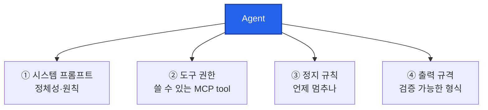
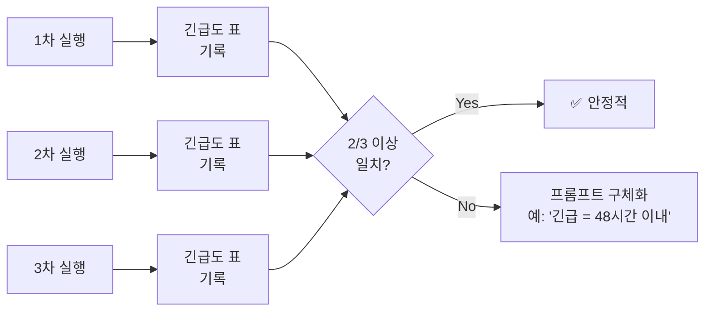

# 05. 단일 Agent 개발

> Skill은 매뉴얼, MCP는 손발이었습니다. 이제 그 둘을 **하나의 인격**으로 묶습니다. "받은 메일을 요약하는 비서", "회의록을 정리하는 비서" — 각자 맡은 일이 뚜렷한 Agent를 훈련시킵니다.

## 이 모듈을 마치면

- Agent의 정의와 4요소(시스템 프롬프트 · 도구 권한 · 정지 규칙 · 출력 규격)를 설명합니다.
- Cursor에서 **Subagent**를 정의·호출하는 방법을 익힙니다.
- **보너스 A1**: 이메일/Slack 요약 Agent(`email-summarizer`)를 **두 가지 방법**(수동·AI)으로 만듭니다.
- Agent가 "실패할 자유"를 가지게 설계하는 프로토콜을 배웁니다.

## 이론: Agent의 해부학

### Chat과 Agent의 차이

| 구분 | Chat 모드 | Agent (Subagent) |
|------|-----------|-------|
| 턴 수 | 1턴 보조 | 다단계 자율 실행 |
| 입력 | 사람이 매번 질문 | 한 번 작업 지시 → 끝까지 진행 |
| 도구 | 기본적으로 없음 | MCP tool 여러 개 연쇄 호출 |
| 정지 | 사람이 새 질문 | 스스로 완료 판단 or 스텝 제한 |
| 비유 | "이 줄 뭐야?" 묻기 | "오늘 오후 일정 잡고 초대 메일 다 보내" 맡기기 |

Chat은 조수, Agent는 **대리인**입니다. 대리인이 되려면 "역할·원칙·권한·정지조건"이 명확해야 합니다.

### Agent의 4요소



1. **시스템 프롬프트(역할)**: "너는 ___이다. 이런 원칙을 지킨다." 정체성 선언.
2. **도구 권한(MCP)**: 쓸 수 있는 Tool 목록. 필요 없는 권한은 주지 않습니다.
3. **정지 규칙**: 무한 루프 방지. "최대 스텝 N", "출력이 이 형식을 만족하면 끝".
4. **출력 규격**: 마크다운 표, JSON 스키마 등 **검증 가능한 형식**.

이 네 가지가 빠지면 Agent는 "말만 많고 결과가 없는 수습사원"이 됩니다.

### Cursor의 Subagent (공식 기능, Cursor 2.4+)

Cursor 2.4 changelog에서 공식 도입된 개념이 **Subagents**입니다. 부모 에이전트(사용자가 대화하는 메인 AI)의 하위 작업을 맡는 독립 에이전트입니다.

- **저장 위치 (Windows)**
  - 프로젝트: `<project>\.cursor\agents\<이름>.md`
  - 사용자 전역: `%USERPROFILE%\.cursor\agents\<이름>.md`
- **파일 포맷**: 마크다운 + YAML frontmatter

```yaml
---
name: email-summarizer
description: "이메일·Slack 로그를 요약·우선순위 분류하는 에이전트. '메일 요약', '받은편지함 정리', 'Slack 오늘 놓친 거' 발화에 반응."
model: inherit          # inherit | fast | <model-id>
readonly: false
is_background: false
---

(여기 아래에 본문 프롬프트)
```

- `model: inherit`: 부모 Agent와 같은 모델 사용 (권장).
- `readonly: true`: 파일 쓰기/MCP 호출 차단. 안전한 분석 전용 Agent 만들 때.
- `is_background: true`: Agents Window에서 백그라운드로 떠 있음.

⚠️ **`/create-subagent`는 Cursor 공식 슬래시 명령이 아닙니다.** 공식 가이드는 두 가지입니다 — 방법 A(수동 파일 생성), 방법 B(자연어 요청). 아래 실습에서 둘 다 보입니다.

### Skill vs Subagent — 비슷한데 다름

| 항목 | Skill | Subagent |
|------|-------|----------|
| 위치 | `.cursor\skills\` | `.cursor\agents\` |
| 단위 | 매뉴얼(절차) | 독립 실행 주체(작은 AI 인스턴스) |
| 컨텍스트 | 부모의 컨텍스트 | 자기만의 격리된 컨텍스트 |
| 병렬 | 안 됨 | 됨 (여러 Subagent 동시 실행) |
| 언제 | 단일 태스크, 한 번 실행 | 격리·병렬·독립 실행 필요할 때 |

한 줄 정리: **"단발성 매뉴얼이면 Skill, 독립된 실행 주체가 필요하면 Subagent."**

### 좋은 Agent의 원칙 — "실패할 자유"

Agent 설계에서 가장 흔한 실수는 "Agent가 어떻게든 답을 내도록 몰아붙이기"입니다. 더 좋은 설계는 **실패 경로를 명시**하는 것입니다.

- "입력 파일이 비어 있으면 '빈 입력' 태그를 단 빈 결과를 반환하고 종료."
- "5회 연속 tool 호출 실패 시 중단하고 `runs\failures.jsonl`에 기록."
- "출력 스키마 검증 실패가 3회 넘으면 사람에게 물어본다."

Agent가 "실패할 자유"를 가지면 오히려 **시스템 전체의 실패율은 낮아집니다**. 무리하지 않기 때문입니다.

### 일관성 테스트

같은 입력으로 Agent를 **3회 반복 실행**해 결과를 비교하세요. 세 번 다 크게 다르면 프롬프트가 모호하거나 출력 규격이 느슨한 것입니다. 이건 "LLM의 비결정성"이 아니라 **설계 미흡**입니다.

### 비용·지연 관리

- 모델 선택: 복잡도가 낮으면 `flash-lite`, 판단이 중요하면 `flash`, 정교함이 필요하면 `pro`.
- 최대 스텝 제한: Cursor Agent 설정에서 `max steps`를 걸어두세요. 무한 루프 안전판.
- 로그 남기기: 각 Agent 호출을 `runs\<agent>-<timestamp>.jsonl`로 append. 나중에 "왜 그렇게 답했지?"가 가능해집니다.

## 실습 (보너스 A1): `email-summarizer` 만들기

### 시나리오

"내 받은편지함이 오늘만 6통 쌓였다. 스팸·뉴스레터·진짜 업무 메일이 섞여 있는데 30초 안에 '오늘 내가 뭘 해야 하지?'를 알고 싶다."

Cursor Subagent 1명이 이 일을 맡도록 훈련시킵니다.

### 준비물

- `vibe-1st` 프로젝트
- 모듈 04의 `file-manager-mcp` MCP (또는 공식 `filesystem` MCP) 등록 상태
- 샘플 이메일 데이터 (아래 Step 1)

### Step 1. 샘플 데이터 만들기

실제 Gmail/Slack 연결은 OAuth 복잡해서 오늘은 **샘플 파일** 기반으로.

- **어디서**: Cursor Agent 모드
- **무엇을 입력**:

```
inbox\ 폴더를 만들고, 아래 6개 .eml 파일을 만들어줘.
각 파일은 마크다운 느낌의 간단한 텍스트로 — From, To, Subject, Date, 본문 3~5문장.
내용은 서로 다르고 현실적인 업무 메일로:
1. 01-meeting-invite.eml — 프로젝트 킥오프 회의 초대
2. 02-urgent-bug.eml — 프로덕션 버그 긴급 보고
3. 03-newsletter.eml — 사내 뉴스레터 (광고성)
4. 04-1on1-request.eml — 매니저와 1:1 요청
5. 05-contract-review.eml — 계약서 검토 요청 (기한 명시)
6. 06-spam.eml — 명백한 스팸
모든 파일의 Date는 2026-04-23 범위로.
```

- **무엇을 기대**: `inbox\` 에 6개 `.eml` 파일 생성.

## 두 가지 만드는 방법

### 방법 A: 수동 작성

#### A-1. 폴더·파일 만들기

- **어디서**: PowerShell
- **무엇을 입력**:

```powershell
cd $env:USERPROFILE\vibe-1st
mkdir .cursor\agents -Force
New-Item .cursor\agents\email-summarizer.md -ItemType File
```

#### A-2. 내용 붙여넣기

`.cursor\agents\email-summarizer.md`에 아래 내용을 그대로:

````markdown
---
name: email-summarizer
description: "받은 편지함(.eml)이나 Slack 로그(JSON)를 요약하고 우선순위·액션 여부를 판정하는 에이전트. '메일 요약해줘', '오늘 받은 편지 정리', '받은편지함 우선순위' 발화에 반응."
model: inherit
readonly: false
is_background: false
---

# Email Summarizer Agent

## 역할

너는 받은 편지함과 Slack 로그를 훑어 사람이 1분 안에 결정을 내릴 수 있도록 요약하는 전담 비서다. 제목과 본문을 모두 읽되, 한국어로 간결하게 답한다.

## 원칙

1. 모든 메일에 대해 아래 5개 필드를 **반드시** 채운다.
   - `긴급도`: 긴급 / 보통 / 낮음 (긴급은 "오늘 안에 대응" 기준)
   - `발신자`: 이름만 (이메일 주소 노출 금지)
   - `1줄요약`: 40자 이내
   - `액션필요`: 예 / 아니오
   - `기한`: YYYY-MM-DD 또는 "명시 없음"
2. 광고성·뉴스레터·스팸은 `긴급도=낮음`, `액션필요=아니오`로 자동 분류한다.
3. 개인정보(메일 주소, 전화번호)를 출력에 포함하지 않는다.
4. 판단이 애매하면 보수적으로 `긴급도=보통`.
5. tool 호출 실패가 3회 연속이면 그 파일은 `read_error` 태그를 달고 건너뛴다.

## 입력

- 기본값: `inbox\` 폴더의 모든 `.eml` 파일
- 사용자가 다른 폴더를 지정하면 거기 기준.

## 출력 스키마 (마크다운 표)

| 파일 | 긴급도 | 발신자 | 1줄요약 | 액션필요 | 기한 |
|------|--------|--------|---------|----------|------|
| 01-... | 긴급 | ... | ... | 예 | 2026-04-24 |

표 아래에 **총평 3줄**을 추가한다:
- 총 N개 중 긴급 M개
- 오늘(2026-04-23) 즉시 대응 권장 항목: [파일명 리스트]
- 무시 가능 항목: [파일명 리스트]

## 사용 도구

- `list_files`: inbox 폴더의 파일 목록 가져오기
- `read_file` (또는 공식 filesystem MCP의 `read_text_file`): 각 eml 내용 읽기
- `write_file`: 최종 결과를 `inbox\digest.md`로 저장

## 정지 규칙

- 모든 입력 파일 처리 완료 시 종료
- 총 tool 호출 20회 초과 시 중단하고 현재까지의 결과를 저장
- 출력 스키마 검증(행 수 == 입력 파일 수) 실패 시 사람에게 보고

## 실패 처리

- 읽기 실패 파일은 표에 `read_error` 행으로 남긴다.
- 전체 실패 시 `runs\email-summarizer-<timestamp>.jsonl`에 에러 로그 append.
````

### 방법 B: AI에게 맡기기 (권장)

- **어디서**: Cursor Agent 모드
- **무엇을 입력**:

```
.cursor\agents\email-summarizer.md 파일로 Cursor Subagent를 하나 만들어줘.

이 Agent는 inbox\ 폴더의 .eml 파일 6개를 읽고 마크다운 표로 요약하는 전담 비서야.

요구사항:
- frontmatter: name, description(트리거 발화 3개 이상), model=inherit, readonly=false.
- 출력 컬럼: 파일, 긴급도(긴급/보통/낮음), 발신자(이름만), 1줄요약(40자 이내), 액션필요(예/아니오), 기한.
- 원칙: 개인정보(메일주소, 전화번호) 출력 금지. 광고/뉴스레터/스팸은 자동 '낮음'.
- 정지 규칙: 파일 다 처리 완료 시 종료, 총 tool 호출 20회 초과 시 중단.
- 결과는 inbox\digest.md 로 저장.
- 실패 처리: 읽기 실패 파일은 read_error 행으로.

파일 생성 후 frontmatter 5줄만 한번 더 보여줘.
```

- **무엇을 기대**: Agent가 `.cursor\agents\email-summarizer.md`를 생성. frontmatter 5줄 요약 출력.

#### B-2. 검토 체크리스트

- [ ] `name: email-summarizer` (파일명과 일치)
- [ ] `description`에 발화 예시 3개 이상
- [ ] 출력 컬럼 6개 정확
- [ ] 개인정보 보호 원칙 명시
- [ ] 정지 규칙 (파일 수 제한, tool 호출 제한) 있음
- [ ] 저장 경로 `inbox\digest.md` 명시

### 언제 어느 걸

- 구조 학습 목적 → A
- 빠르게 프로토타입 → B
- 실무: B로 뼈대, A로 원칙·예외 다듬기

## Step 2. Agent 호출

- **어디서**: Cursor Chat
- **무엇을 입력**:

```
@email-summarizer inbox\ 의 메일들을 요약해줘.
결과는 inbox\digest.md 로 저장해줘.
```

또는 Cursor 버전에 따라 Agents Window에서 직접 실행 버튼이 보이기도 합니다.

- **무엇을 기대**:
  - Agent가 `list_files`로 6개 파일 확인
  - 각 파일을 `read_file`로 순회 읽기
  - 마크다운 표 + 총평 3줄 생성
  - `write_file`로 `digest.md` 저장
  - Chat에 "완료. digest.md 생성" 메시지

## Step 3. 결과 검증

- **어디서**: 파일 트리 → `inbox\digest.md` 열기
- **무엇을 확인**:
  - 행 수가 6행 (입력 파일 수와 동일)?
  - 스팸(`06-spam.eml`)이 "낮음 / 아니오"로 분류됐나?
  - 긴급 버그(`02-urgent-bug.eml`)가 "긴급 / 예"로 분류됐나?
  - 개인정보(이메일 주소)가 노출됐나? (있으면 프롬프트 원칙 위반, 수정 필요)

## Step 4. 일관성 테스트

같은 요청을 **3회 반복** 실행해 결과를 비교합니다.



- **확인 포인트**: 6개 파일 각각의 `긴급도`가 3회 중 2회 이상 동일한가? (일관성 지표)
- **결과가 흔들리면**: 프롬프트의 "긴급" 정의를 더 구체화하세요. 예: "마감이 48시간 이내면 긴급".

## Step 5. Slack 로그 확장 (옵션)

같은 Agent가 Slack export JSON도 처리하게 확장할 수 있습니다.

- **어디서**: Agent 모드
- **무엇을 입력**: `inbox\slack-export.json` 샘플을 만들어달라고 요청 후, Agent의 description에 "Slack export JSON도 처리"를 추가.
- **무엇을 기대**: 같은 출력 스키마(마크다운 표)로 Slack 메시지도 요약됩니다.

## Step 6. Gemini API로 직접 돌려보기 (보너스)

Agent가 하는 일을 **순수 Python + Gemini**로도 할 수 있다는 걸 확인합니다. Agent라는 개념이 "LLM 호출 + 도구 호출 + 루프"의 조합임을 체감하는 스텝입니다.

`email_summarize_gemini.py`:

```python
import os, json, pathlib
from google import genai

INBOX = pathlib.Path("inbox")
client = genai.Client(api_key=os.environ["GEMINI_API_KEY"])

def summarize_one(path):
    content = path.read_text(encoding="utf-8")
    prompt = f"""다음 이메일을 아래 JSON 스키마로 요약해줘.
스키마: {{"긴급도": "긴급|보통|낮음", "발신자": "이름만", "1줄요약": "40자 이내", "액션필요": "예|아니오", "기한": "YYYY-MM-DD 또는 명시 없음"}}

이메일:
{content}

JSON만 출력해. 다른 말은 금지."""
    resp = client.models.generate_content(
        model="gemini-2.5-flash",
        contents=prompt,
    )
    raw = resp.text.strip()
    # Gemini가 ```json 래퍼를 붙일 수 있으니 제거
    if raw.startswith("```"):
        raw = raw.strip("`").lstrip("json").strip()
    return json.loads(raw)

rows = []
for p in sorted(INBOX.glob("*.eml")):
    try:
        data = summarize_one(p)
        rows.append({"파일": p.name, **data})
    except Exception as e:
        rows.append({"파일": p.name, "error": str(e)})

# 마크다운 표로 출력
headers = ["파일", "긴급도", "발신자", "1줄요약", "액션필요", "기한"]
print("| " + " | ".join(headers) + " |")
print("|" + "---|" * len(headers))
for r in rows:
    print("| " + " | ".join(str(r.get(h, "")) for h in headers) + " |")
```

실행 (PowerShell, venv 활성화된 상태):

```powershell
cd $env:USERPROFILE\vibe-1st
python email_summarize_gemini.py > inbox\digest-gemini.md
```

- **무엇을 기대**: Cursor의 Agent 결과와 거의 비슷한 마크다운 표가 `digest-gemini.md`에 저장. 두 결과를 열어 비교해보세요. "Cursor Agent"와 "직접 API 루프"의 차이가 **편의성뿐**이라는 감각을 얻습니다.

## 💡 Tip Box: 서브에이전트 / 프롬프트 공유 관행

Rules·Skill이 커뮤니티에서 활발히 공유되는 데 비해, **Subagent 공유는 2026-04 기준 비교적 초기**입니다. 현재 통용되는 관행을 정리합니다.

### (a) 공식 공유 메커니즘

- **Cursor 자체의 공식 공유 메커니즘은 아직 없습니다.** Cursor Directory에도 Subagents 카테고리는 Skills보다 빈약합니다.
- **표준 관행**: `.cursor\agents\` 디렉토리를 **git에 커밋** → 리포 내 팀 공유가 기본.

### (b) 커뮤니티 컬렉션 (참고용)

- `https://github.com/spencerpauly/awesome-cursor-skills` — Cursor Skills/Subagents 큐레이션
- `https://github.com/VoltAgent/awesome-agent-skills` — Anthropic·Google·Vercel·Stripe·Cloudflare 등 실제 팀의 스킬 포함
- `https://github.com/shinpr/sub-agents-mcp` — MCP를 통해 여러 백엔드에 서브에이전트 배포

### (c) 권장 공유 흐름

1. GitHub Gist 또는 레포 README에 Subagent `.md` 파일 내용 게시
2. "복사해서 `.cursor\agents\<이름>.md`로 저장" 안내
3. 의존 MCP 서버가 있으면 해당 `mcp.json` 항목도 함께 제공

### (d) 팀 내 베스트프랙티스

- **한 리포에 agents/·skills/·mcp/ 디렉토리를 모두 두고 git 관리**하면, 신규 팀원이 `git clone` 한 번으로 전체 환경을 복제할 수 있습니다.
- `README.md`에 각 Agent의 "언제 쓰나 / 필요한 MCP / 예상 출력"을 표로 정리하면 유지보수가 쉽습니다.

⚠️ 회사 코드와 같은 리포에 넣을지, 별도 `company-cursor-config` 리포를 팔지는 보안 정책에 따라 결정하세요. 민감 프롬프트가 git 히스토리에 남는 건 리스크입니다.

## 자주 막히는 지점

- **증상**: `@email-summarizer`로 호출했는데 Agent가 발동이 안 된다.
  **해결**: `.cursor\agents\` 경로 오타, frontmatter의 `name`이 파일명과 불일치, description에 트리거 표현 부족 — 이 셋을 먼저 확인.

- **증상**: Agent가 "파일을 읽을 수 없다"라며 멈춘다.
  **해결**: `file-manager-mcp` MCP가 Cursor에 등록돼 있고 초록불인지 확인. ALLOWED_ROOT가 `inbox\`를 포함하는지도.

- **증상**: 출력이 마크다운 표가 아니라 자유 서술로 나온다.
  **해결**: 프롬프트 "출력 스키마" 섹션을 더 강하게 — "반드시 아래 마크다운 표 형식으로만. 다른 산문 금지."

- **증상**: 같은 요청 3회 중 결과가 매번 다르다.
  **해결**: "긴급도" 같은 주관적 필드에 객관 기준을 더하세요. "마감 48시간 이내 = 긴급" 같은 수치 규칙.

- **증상**: 개인정보(이메일 주소)가 출력에 섞여 나온다.
  **해결**: 프롬프트 원칙 3에 "메일 주소, 전화번호, 물리 주소를 출력에 포함하지 않는다"를 명시하고, 예시로 **마스킹된 형태**를 보여주세요. LLM은 "하지 마"보다 "이렇게 해"에 더 잘 반응합니다.

- **증상**: Agent가 한 번에 20개 tool 호출을 다 소진하고 멈춘다.
  **해결**: 프롬프트의 "정지 규칙"을 보완. "파일 1개당 `read_file` 1회만" 같은 횟수 제한 추가.

## 핵심 요약

- Agent = **역할 + 도구 권한 + 정지 규칙 + 출력 규격** 의 조합.
- Cursor Subagent는 `.cursor\agents\<이름>.md`에 정의. 만드는 법 2가지: 수동(A) + AI(B).
- 좋은 Agent는 "실패할 자유"를 가진다 — 실패 경로를 명시할 것.
- 같은 입력 3회 테스트로 일관성 검증.

## 다음 모듈로 가기 전에 (체크리스트)

- [ ] `.cursor\agents\email-summarizer.md` 생성 및 frontmatter 검증
- [ ] `inbox\digest.md` 생성됨 (6행 마크다운 표 + 총평 3줄)
- [ ] 일관성 테스트 3회 실행 결과 비교 완료
- [ ] "Agent 4요소" 각 요소의 예를 말로 설명할 수 있다

## 슬라이드 요약

- Agent는 Chat과 다르다 — 다단계 자율 실행 주체.
- 4요소: 역할 · 도구 권한 · 정지 규칙 · 출력 규격.
- Cursor Subagent = `.cursor\agents\<이름>.md`. 만드는 법 2가지: 수동(A) + AI(B).
- "실패할 자유"를 설계에 명시하면 시스템 전체 실패율이 내려간다.
- 공유 관행: `.cursor\agents\`를 git 커밋. 공식 마켓플레이스는 아직 초기.
