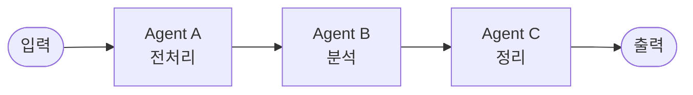
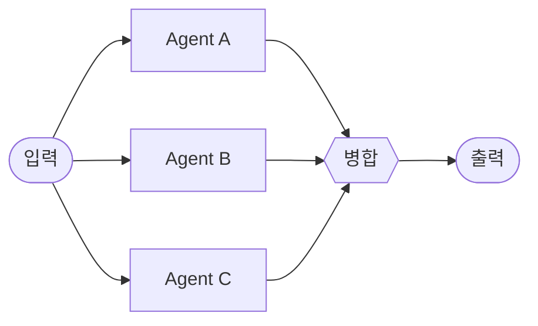
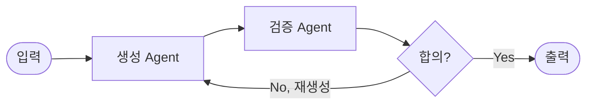
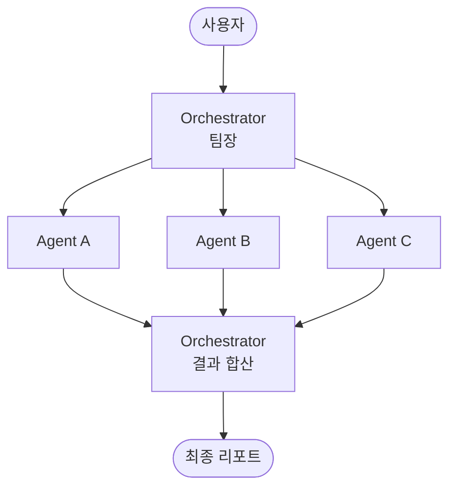
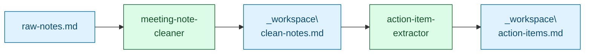

# 06. Multi-Agent 협업

> 혼자 잘하는 비서도 좋지만, 두세 명이 역할을 나눠 일하면 훨씬 안정적입니다. 이번 모듈은 **팀장(오케스트레이터)이 하위 비서들에게 일을 분배하고 결과를 합쳐오는 구조**를 손에 익힙니다. 캡스톤(모듈 07)의 뼈대가 여기서 만들어집니다.

## 이 모듈을 마치면

- Multi-Agent의 4가지 협업 패턴(릴레이 / 병렬 / 합의 / 오케스트레이터)을 구분합니다.
- Agent 간 메시지 규격과 **공용 워크스페이스** 설계를 설명합니다.
- **보너스 A2**: 회의록 → 액션 아이템 **2-에이전트** 시스템(`meeting-notes-extractor`)을 완성합니다.
- 캡스톤에서 쓸 오케스트레이터 스켈레톤을 손에 익힙니다.

## 이론: 왜 여러 명인가

### 단일 Agent의 한계

모듈 05의 단일 Agent는 "이메일 요약"처럼 **범위가 좁은** 일엔 훌륭합니다. 하지만 "회의록을 받아서 1차 정리하고, 액션 아이템을 추출한 다음, 담당자별로 분류한다" 같은 **다단계·다관점** 업무로 가면 한 프롬프트에 모든 책임을 몰아넣게 됩니다. 이 순간 네 가지 문제가 생깁니다.

1. **프롬프트 비대화**: 역할이 뭉뚱그려져 결과가 흐려짐.
2. **디버깅 곤란**: 어디서 틀렸는지 추적이 안 됨.
3. **모델 낭비**: 간단한 전처리에도 고성능 모델을 써야 함.
4. **재사용 불가**: "회의록 전처리" 단계만 다른 업무에 재사용하고 싶어도 분리가 안 돼 있음.

### 4가지 협업 패턴

한 시스템에서 섞어 쓰는 경우도 많습니다.

#### (1) 릴레이 (Relay / Pipeline)



각 Agent가 앞 단계의 결과를 받아 **다음 단계**에 넘깁니다. 컨베이어 벨트.

- 장점: 각 Agent가 한 가지에 집중, 디버깅 쉬움.
- 예: 회의록 정리(A) → 액션 아이템 추출(B) → 담당자별 분류(C).

#### (2) 병렬 (Parallel / Fan-out)



같은 입력을 **여러 Agent가 동시에** 처리하고, 마지막에 합칩니다.

- 장점: 속도·관점 다양성.
- 예: 한국어 뉴스 Agent와 영어 뉴스 Agent가 같은 키워드를 동시에 수집 (모듈 07 캡스톤).

#### (3) 합의 (Debate / Generate-Verify)



한 Agent가 **초안**을 만들고, 다른 Agent가 **검증**합니다. 불합치 시 재작업.

- 장점: 품질 상승, 환각(hallucination) 감소.
- 예: 뉴스 요약(생성) ↔ 팩트체커(검증) → 상충 플래그 붙이기.

#### (4) 오케스트레이터 (Orchestrator)



**팀장 Agent**가 위 세 패턴을 지휘합니다. 작업 분배, 재시도, 결과 합산, 최종 리포트까지.

- 장점: 사용자는 팀장과만 대화, 팀장이 나머지를 조율.
- 예: 모듈 07 캡스톤의 `orchestrator`.

### 공용 워크스페이스 패턴

Agent들이 서로 어떻게 결과를 주고받을까요? 두 가지 방식이 있습니다.

#### (A) 반환값 기반

Agent A의 함수 호출 결과가 Agent B의 입력이 됩니다. 짧은 파이프라인에 깔끔합니다.

#### (B) 파일 기반 (권장, 교육용)

각 Agent가 **공용 폴더**(`_workspace\`)에 중간 산출물을 저장합니다. 다음 Agent가 그 파일을 읽습니다.

```
_workspace\
├── input.md           (사용자 입력)
├── clean-notes.md     (A가 저장)
├── action-items.json  (B가 읽고 저장)
└── report.md          (C가 만든 최종)
```

- 장점: **관찰 가능성**. 중간 산출물을 사람이 눈으로 확인 가능. 디버깅 천국.
- 단점: 파일 I/O 오버헤드. 대용량 데이터에는 부적합.
- 교육 환경에서는 무조건 (B). 모듈 07 캡스톤도 이 방식.

### Agent 간 메시지 규격 3요소

Agent 간 주고받는 메시지는 **JSON** 또는 **구조화된 마크다운**으로 통일.

1. **발신자** (`from`): 누가 만든 결과인지
2. **목적** (`purpose`): 왜 이 메시지를 보냈는지
3. **첨부 경로** (`artifacts`): 관련 파일 경로들

예시:

```json
{
  "from": "meeting-note-cleaner",
  "purpose": "1차 정리된 회의록 전달",
  "artifacts": ["_workspace\\clean-notes.md"],
  "next": "action-item-extractor"
}
```

### 실패 격리 (Fault Isolation)

한 Agent의 실패가 **전체를 멈추지 않게** 해야 합니다.

- 각 Agent는 자기 실패를 `runs\<agent>-<timestamp>.jsonl`에 기록하고 **빈 결과**를 반환.
- 오케스트레이터는 "빈 결과"를 감지해 재시도 또는 대체 경로 선택.
- 3회 연속 실패 시에만 전체 워크플로우 중단.

### 관측 (Observability)

각 Agent 호출을 JSONL 로그로 남기면 "왜 그 답이 나왔지?"를 되짚을 수 있습니다.

```
runs\
├── meeting-note-cleaner-20260423T143000.jsonl
├── action-item-extractor-20260423T143015.jsonl
└── orchestrator-20260423T143030.jsonl
```

한 줄당 하나의 이벤트(tool 호출, LLM 응답, 에러). 이게 쌓이면 Agent의 "의사결정 일지"가 됩니다.

## 실습 (보너스 A2): `meeting-notes-extractor` 2-Agent 시스템

### 시나리오

"매주 월요일 팀 회의가 끝나면 슬랙에 누군가 거친 회의록을 붙여넣는다. 그걸 읽고 담당자별 액션 아이템 표로 정리해야 한다."

**두 명의 비서에게 맡깁니다.**

- `meeting-note-cleaner`: 거친 회의록을 정제된 섹션 구조로 정리.
- `action-item-extractor`: 정리된 회의록에서 액션 아이템을 추출·분류.

공통 폴더 이름은 `meeting-notes-extractor` (프로젝트 폴더 또는 git 저장소 이름으로 재사용 가능).

### 아키텍처 다이어그램



### 준비물

- `vibe-1st` 프로젝트
- 모듈 04의 `file-manager-mcp` MCP (또는 공식 `filesystem` MCP)
- 샘플 회의록 1장 (Step 1)

### Step 1. 샘플 회의록 만들기

- **어디서**: Cursor Agent 모드
- **무엇을 입력**:

```
meeting-notes-extractor\ 폴더를 만들고, 그 안에 raw-notes.md 파일을 만들어줘.
내용은 가상의 "프로덕트 주간 회의"를 거칠게 받아적은 듯한
구어체 문장들로 500자 이상. 결정 사항, 이견, 농담, 행동 항목이 뒤섞인 자연스러운 회의록.
참석자 3명(김PM, 이DEV, 박DES)이 언급되고, 마감일이 두어 개 자연스럽게 녹아 있게.
```

- **무엇을 기대**: `meeting-notes-extractor\raw-notes.md` 생성 (500자+).

### Step 2. `meeting-note-cleaner` Agent 정의

- **어디서**: Agent 모드
- **무엇을 입력**: `.cursor\agents\meeting-note-cleaner.md` 생성 요청

````markdown
---
name: meeting-note-cleaner
description: "거친 회의록을 섹션 구조로 정리하는 에이전트. '회의록 정리해줘', '노트 클린업' 발화에 반응."
model: inherit
readonly: false
---

# Meeting Note Cleaner

## 역할
거친 회의록 원문을 받아 사람이 읽기 쉬운 섹션 구조로 재편성한다.

## 원칙
1. 원문의 의미는 손실시키지 않는다. 추측해서 추가하지 않는다.
2. 농담·잡담·사적 대화는 별도 섹션 "여담(선택)"으로 분리.
3. 참석자 이름은 원문 그대로 유지.
4. 결정·이견·행동 항목은 **별도 섹션**으로 분리.

## 입력
`meeting-notes-extractor\raw-notes.md` (또는 사용자가 지정한 파일)

## 출력 스키마 (마크다운)

```
# 회의록 - {날짜}

## 참석자
- ...

## 안건
1. ...

## 결정 사항
- ...

## 이견 / 추가 논의 필요
- ...

## 행동 항목 (원문 그대로, 분석은 다음 에이전트)
- [원문 발췌 1]
- [원문 발췌 2]

## 여담 (선택)
- ...
```

저장 위치: `_workspace\clean-notes.md`

## 사용 도구
- `read_file` / `read_text_file`: 원문 읽기
- `write_file`: 결과 저장

## 정지 규칙
- 저장 완료 시 종료
- 총 tool 호출 5회 초과 시 중단

## 실패 처리
- 입력 파일이 비어 있으면 `empty_input` 태그를 단 빈 스켈레톤만 저장
````

### Step 3. `action-item-extractor` Agent 정의

- **어디서**: Agent 모드
- **무엇을 입력**: `.cursor\agents\action-item-extractor.md` 생성 요청

````markdown
---
name: action-item-extractor
description: "정리된 회의록에서 액션 아이템을 추출·분류하는 에이전트. '액션 아이템 뽑아줘', '할 일 정리' 발화에 반응."
model: inherit
readonly: false
---

# Action Item Extractor

## 역할
`_workspace\clean-notes.md`를 입력받아 액션 아이템을 추출하고, 담당자·기한·우선순위를 부여한다.

## 원칙
1. "행동 항목" 섹션을 주된 입력으로 보되, "결정 사항"에 숨은 액션도 포착한다.
2. 담당자 추정이 애매하면 `미정`. 임의 배정 금지.
3. 기한 표현이 없으면 `미정`. "다음 주" 같은 상대 표현은 오늘(2026-04-23) 기준으로 절대 날짜 변환.
4. 우선순위 기준:
   - `높음`: 마감 3일 이내 또는 명시된 `긴급`·`블로커`
   - `보통`: 일반
   - `낮음`: "여유되면", "혹시" 류의 표현

## 입력
`_workspace\clean-notes.md`

## 출력 스키마 (마크다운 표)

| 담당자 | 기한 | 액션 | 우선순위 | 원문 근거 |
|--------|------|------|----------|-----------|
| 이DEV | 2026-04-26 | DB 마이그레이션 스크립트 작성 | 높음 | "이DEV가 수요일까지..." |

표 아래 **요약 3줄**:
- 총 N건, 높음 M건
- 담당자별 건수 (이DEV: 3, 박DES: 2, 미정: 1)
- 이번 주(~2026-04-26) 마감 건수: K

저장 위치: `_workspace\action-items.md`

## 사용 도구
- `read_file`: clean-notes.md 읽기
- `write_file`: action-items.md 저장

## 정지 규칙
- 저장 완료 시 종료
- 총 tool 호출 5회 초과 시 중단

## 실패 처리
- 입력 파일이 없거나 `empty_input` 태그가 있으면 `no_input` 표기 후 종료
````

💡 두 Agent 모두 "방법 B(AI에게 맡기기)"로 생성하는 게 빠릅니다. 위 스펙을 그대로 Agent 모드에 "이 두 Agent를 만들어줘"라고 던지면 됩니다. 만든 뒤엔 반드시 frontmatter의 `name`·`description`·`readonly`를 눈으로 검증하세요.

### Step 4. 릴레이 실행

- **어디서**: Cursor Chat 모드
- **무엇을 입력**:

```
먼저 @meeting-note-cleaner 로 meeting-notes-extractor\raw-notes.md 를 정리해줘.
그 결과가 나오면 이어서 @action-item-extractor 를 돌려서
_workspace\action-items.md 를 만들어줘.
```

- **무엇을 기대**:
  1. `_workspace\clean-notes.md` 생성 — 깔끔한 섹션 구조
  2. `_workspace\action-items.md` 생성 — 담당자별 액션 표

중간 산출물을 **눈으로 열어보는 것**이 포인트입니다. 이게 (B) 파일 기반 방식의 강점입니다.

### Step 5. 병렬 패턴 맛보기 — Cleaner를 2개로 복제

한국어판과 영문판을 동시에 만들고 싶다면 Cleaner를 복제합니다.

- **어디서**: Agent 모드
- **무엇을 입력**:

```
.cursor\agents\meeting-note-cleaner-en.md 를 만들어줘.
내용은 meeting-note-cleaner.md 와 동일하되:
- 출력 언어: 영어
- 출력 경로: _workspace\clean-notes-en.md
frontmatter의 name은 meeting-note-cleaner-en.
```

- **실행**:

```
@meeting-note-cleaner 와 @meeting-note-cleaner-en 을 병렬로 실행해.
둘 다 meeting-notes-extractor\raw-notes.md 를 입력으로.
```

- **무엇을 기대**: `_workspace\clean-notes.md`(한국어)와 `_workspace\clean-notes-en.md`(영어)가 **동시에** 생성됩니다.

### Step 6. 오케스트레이터 스켈레톤 (모듈 07 예고편)

모듈 07에서 본격 만들 오케스트레이터의 뼈대만 미리 봅니다.

```markdown
---
name: meeting-orchestrator
description: "회의록 처리 파이프라인 팀장. 'raw-notes 처리해줘', '회의록 전체 처리' 발화에 반응."
model: inherit
readonly: false
---

# Meeting Orchestrator

## 역할
회의록 처리 파이프라인의 팀장. 사용자 입력을 받아 cleaner → extractor 순으로 지휘하고, 최종 리포트 링크를 사용자에게 보고.

## 원칙
1. 각 하위 Agent 호출을 `runs\<agent>-<timestamp>.jsonl`에 기록
2. cleaner 실패 시 3회 재시도, 그래도 실패하면 사용자에게 보고하고 중단
3. extractor는 cleaner 성공 후에만 실행
4. 최종 사용자 메시지는 "행동 항목 N건 추출됨. `_workspace\action-items.md` 참조."

## 프로세스
1. @meeting-note-cleaner 호출 → `_workspace\clean-notes.md` 확인
2. @action-item-extractor 호출 → `_workspace\action-items.md` 확인
3. 두 파일 존재 확인 후 사용자에게 보고
```

모듈 07에서 이 패턴이 **4개 Agent를 지휘하는 오케스트레이터**로 확장됩니다.

### Step 7. 실제 회의록으로 파일럿 (옵션)

본인이 참여한 실제 회의록(익명화 주의)으로 같은 파이프라인을 돌려보고 품질을 체크합니다.

- **확인 포인트**:
  - 액션 아이템을 놓친 게 있는가?
  - 담당자가 잘못 배정된 게 있는가?
  - 기한 계산이 맞는가? (상대→절대 변환)

품질이 낮으면 프롬프트 원칙을 추가·구체화합니다.

## 💡 Tip Box: Multi-Agent 팀 단위 공유

단일 Agent 공유는 모듈 05에서 다뤘습니다. **여러 Agent가 묶인 "팀" 단위**를 공유하려면 고려할 게 하나 더 늘어납니다.

### (a) 팀 단위 공유 시 꼭 함께 배포할 것

Multi-Agent 시스템은 **Agent 파일만으로는 돌지 않습니다.** 아래 4가지를 한 세트로 묶으세요.

1. `.cursor\agents\*.md` — 각 Agent 정의
2. `.cursor\skills\*\SKILL.md` — Agent들이 참조하는 스킬 (있다면)
3. `mcp.json` 예시 — 필요한 MCP 서버 등록 블록
4. `README.md` — 아키텍처 다이어그램 + 실행 순서 + 기대 입출력

### (b) 리포 구조 템플릿

```
meeting-notes-extractor\
├── README.md              # 아키텍처, 설치, 실행 예시
├── .cursor\
│   ├── agents\
│   │   ├── meeting-note-cleaner.md
│   │   ├── action-item-extractor.md
│   │   └── meeting-orchestrator.md
│   └── mcp.json           # 의존 MCP (file-manager-mcp 등)
├── raw-notes.example.md
└── runs\                  # .gitignore
```

### (c) 공유 시 주의점

- **프롬프트에 회사 고유 맥락**(제품명, 내부 URL, 사내 용어)이 들어 있으면 공개 전 제거·치환하세요.
- **의존 MCP 서버**가 사설 내부망에 있으면 "이 Agent는 내부 전용"임을 README 상단에 명시.
- **라이선스**: MIT 또는 Apache 2.0이 관행이지만, 회사 정책에 따라 내부 전용이면 `UNLICENSED` 또는 사내 라이선스 명시.

### (d) 검색 가능한 메타데이터

팀 리포에서 Agent를 빨리 찾게 하려면 README에 표로 정리하세요.

| Agent | 역할 | 필요 MCP | 평균 실행 시간 |
|-------|------|---------|----------------|
| meeting-note-cleaner | 회의록 1차 정리 | file-manager-mcp | ~5s |
| action-item-extractor | 액션 아이템 추출 | file-manager-mcp | ~7s |
| meeting-orchestrator | 파이프라인 지휘 | file-manager-mcp | ~15s |

### (e) 커뮤니티 참고

- `https://github.com/spencerpauly/awesome-cursor-skills`
- `https://github.com/VoltAgent/awesome-agent-skills` — 복수 Agent 묶음 예시 다수
- `https://github.com/shinpr/sub-agents-mcp` — MCP 기반 Agent 배포 실험

⚠️ 팀 단위 시스템은 "잘 돌아가는 세트 하나"를 만드는 것보다 **"깨지지 않는 세트 하나"**를 만드는 게 더 어렵습니다. 공유 전 3명 이상에게 `git clone → 설치 → 첫 실행`까지 재현해달라고 부탁하세요.

## 자주 막히는 지점

- **증상**: cleaner가 원문을 "해석"해서 없는 내용을 추가한다.
  **해결**: 원칙 1에 "추측해서 추가하지 않는다. 원문에 없는 건 적지 않는다"를 더 강조하고, 예시로 "원문에 마감일이 없으면 비워둔다"를 넣으세요.

- **증상**: extractor가 cleaner 결과를 못 읽는다.
  **해결**: cleaner가 `_workspace\clean-notes.md`에 실제 저장했는지 파일 트리에서 먼저 확인. 없으면 cleaner 쪽 원인. 있으면 extractor의 `read_file` 경로 점검.

- **증상**: 담당자 이름이 "이DEV" → "이개발자"로 바뀐다.
  **해결**: 원칙 3 "참석자 이름은 원문 그대로 유지"를 더 굵게. 또는 출력 예시에서 실제 이름을 그대로 쓰는 걸 보여주세요.

- **증상**: 병렬 실행을 걸었는데 순차로 돈다.
  **해결**: Cursor 버전에 따라 Agents Window의 병렬 지원이 제한적입니다. "병렬로" 명시 + 각 Agent를 **별 대화창**에서 동시에 시작하는 방법도 가능.

- **증상**: 로그(`runs\*.jsonl`)가 비어 있다.
  **해결**: Agent 프롬프트에 "각 단계 결과를 `runs\<name>-<YYYYMMDDTHHMMSS>.jsonl`에 JSON 한 줄씩 append" 지시를 명시적으로 넣으세요. LLM은 요청하지 않은 관측 행위를 알아서 하지 않습니다.

- **증상**: 기한 상대 표현("다음 주")이 절대 날짜로 변환 안 된다.
  **해결**: "오늘은 2026-04-23 입니다. '다음 주 월요일'은 2026-04-27." 처럼 **오늘 날짜를 프롬프트에 명시**해주세요. LLM은 현재 날짜를 모릅니다.

## 핵심 요약

- Multi-Agent 패턴 4종: 릴레이 · 병렬 · 합의 · 오케스트레이터. 섞어 씁니다.
- 교육·디버깅엔 **파일 기반 공용 워크스페이스(B)** 가 정답.
- 메시지 3요소: 발신자 · 목적 · 첨부 경로.
- 실패 격리와 관측(JSONL 로그)이 빠지면 시스템이 자라지 못합니다.

## 다음 모듈로 가기 전에 (체크리스트)

- [ ] `_workspace\clean-notes.md`와 `_workspace\action-items.md` 생성
- [ ] 담당자별 표에 원문 근거 컬럼이 채워져 있다
- [ ] 병렬 실행 1회 성공 (한국어판·영어판)
- [ ] 오케스트레이터 스켈레톤 개념을 말로 설명할 수 있다

## 슬라이드 요약

- 단일 Agent의 4가지 한계 → 팀 편성의 필요.
- 4패턴: 릴레이 / 병렬 / 합의 / 오케스트레이터.
- 공용 워크스페이스(`_workspace\*.md`)가 관찰 가능성의 핵심.
- 메시지 3요소: 발신자 · 목적 · 첨부 경로.
- 팀 단위 공유 체크: agents·skills·mcp.json·README 한 세트.
