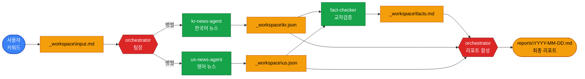
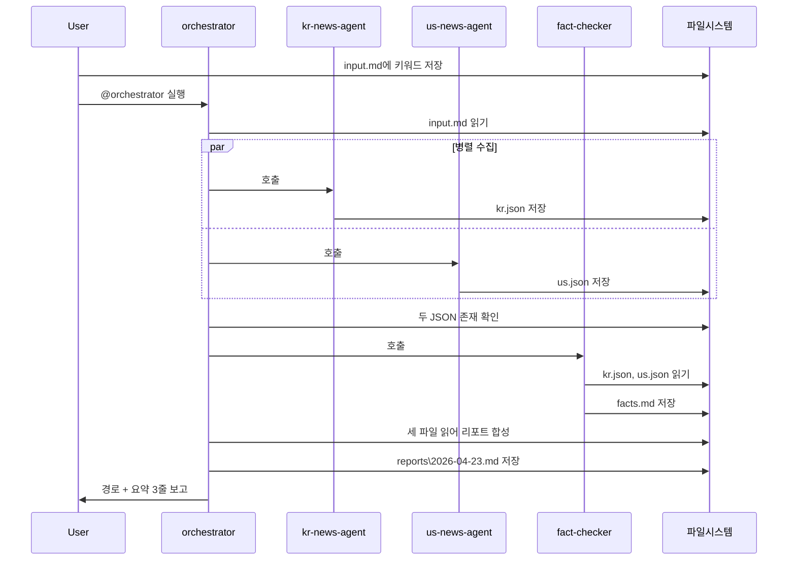
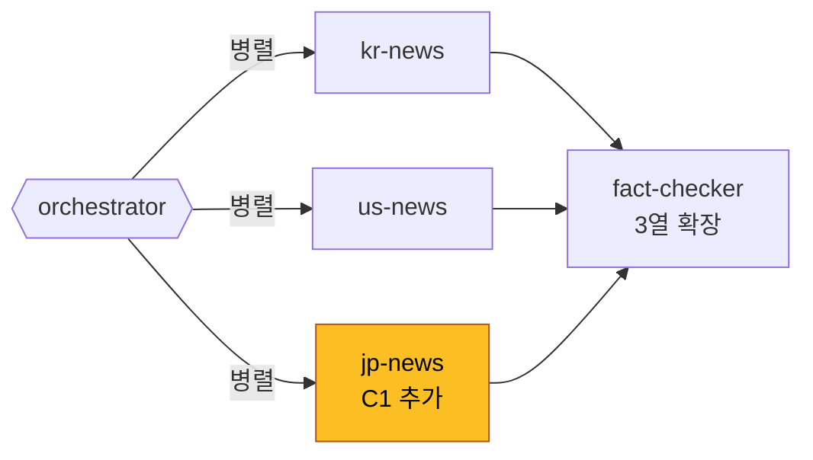

# 07. 실습 B — 한/미 뉴스 멀티에이전트

> 오늘 배운 모든 개념(Skill · MCP · Agent · Multi-Agent · Workflow)을 하나의 산출물로 녹입니다. **키워드 한 마디**를 넣으면 30분도 안 걸려 한·미 매체 비교 브리프가 떨어지는 "나만의 뉴스룸"을 만듭니다.

## 이 모듈을 마치면

- 4개 Agent를 조합해 키워드 입력 → 통합 브리프 리포트를 End-to-End로 생성합니다.
- 팩트체크 교차검증이 품질에 미치는 영향을 **수치로** 관찰합니다.
- 수업 전체 개념을 한 산출물에 녹여 "내 손으로 만든 Agentic 시스템"을 갖습니다.
- 심화 과제 C1~C3(일본 뉴스 · Playwright URL 검증 · Slack 웹훅)의 방향을 스스로 스케치합니다.

## 시나리오

> **"오늘 '반도체 수출 통제' 키워드에 대해 한국과 미국의 주요 매체가 어떻게 다루고 있는지 30분 안에 브리프 한 장을 내 책상에 놓아줘."**

이런 요청을 받았다고 가정합시다. 사람이 직접 한다면:

1. 네이버 뉴스에서 "반도체 수출 통제" 검색 → 상위 5개 읽기
2. Google News에서 "semiconductor export controls" 검색 → 상위 5개 읽기 → 번역
3. 양측 기사에서 주요 주장·수치를 뽑아 교차 비교
4. 상충되는 주장, 빠진 정보 플래그
5. 한 장짜리 리포트로 정리

이걸 **네 명의 비서**(Agent 4개)에게 분담시켜서 병렬로 돌립니다. 공통 폴더 이름은 `news-multiagent`.

## 아키텍처 다이어그램



### 데이터 흐름 단계별 설명

1. 사용자가 `_workspace\input.md`에 키워드 1줄 저장.
2. `orchestrator`가 입력을 읽고 `kr-news-agent`와 `us-news-agent`를 **병렬 실행**.
3. 두 Agent는 각각 RSS/뉴스 소스에서 상위 5개 기사를 가져와 **fetch MCP**로 본문 로드 → 요약 → JSON 저장.
4. `fact-checker`가 두 JSON을 읽어 주장·수치 교차검증, `facts.md` 생성.
5. `orchestrator`가 세 파일(`kr.json`, `us.json`, `facts.md`)을 합쳐 `reports\2026-04-23.md` 최종 리포트 출력.

## 사전 세팅

### 준비물

- 모듈 04의 `file-manager-mcp` 또는 공식 `filesystem` MCP 등록됨
- **`fetch` MCP 서버 등록** (새로 추가)
- `vibe-1st` 프로젝트 아래에 `news-multiagent\` 작업 폴더 생성
- 실습 B 규모로 Gemini를 직접 쓰려면 `GEMINI_API_KEY` 환경변수 (모듈 00에서 등록 완료)

### 작업 폴더 만들기

- **어디서**: PowerShell
- **무엇을 입력**:

```powershell
cd $env:USERPROFILE\vibe-1st
mkdir news-multiagent\_workspace -Force
mkdir news-multiagent\reports -Force
mkdir news-multiagent\runs -Force
```

- **무엇을 기대**: `news-multiagent\` 안에 `_workspace\`, `reports\`, `runs\` 3개 폴더.

### 데이터 소스 전략

본 실습 B은 **공개 RSS**를 기본 전제로 합니다. 뉴스 API 무료 티어는 계정별 제약과 이용약관 검토가 필요해 학습용으로는 RSS가 가장 단순합니다.

- **한국**: 네이버 뉴스 RSS, 연합뉴스 RSS, 다음 뉴스 RSS
- **미국**: Google News RSS (`https://news.google.com/rss/search?q=...&hl=en-US`), Reuters RSS

⚠️ 실제 프로덕션용이라면 각 매체의 이용약관을 확인하고, 저작권·재배포 범위를 교육 목적에 한정하세요.

### fetch MCP 등록

모듈 04 Tip Box에서 소개한 **공식 `fetch` MCP 서버**를 `mcp.json`에 추가합니다.

- **어디서**: `%USERPROFILE%\.cursor\mcp.json`
- **무엇을 입력** (기존 `file-manager-mcp`에 블록 추가):

```json
{
  "mcpServers": {
    "file-manager-mcp": {
      "command": "node",
      "args": [
        "C:\\Users\\me\\vibe-1st\\mcp\\file-manager-mcp\\server.js",
        "C:\\Users\\me\\vibe-1st"
      ]
    },
    "fetch": {
      "command": "npx",
      "args": ["-y", "@modelcontextprotocol/server-fetch"]
    }
  }
}
```

Cursor를 재시작하고 Settings → MCP Servers에서 `fetch`가 초록불이면 준비 완료.

### 공용 워크스페이스 구조

```
news-multiagent\
├── _workspace\
│   ├── input.md             # 사용자 키워드 1줄
│   ├── kr.json              # kr-news-agent 산출
│   ├── us.json              # us-news-agent 산출
│   └── facts.md             # fact-checker 산출
├── reports\
│   └── 2026-04-23.md        # orchestrator가 만드는 최종
└── runs\
    └── *.jsonl              # 각 Agent 실행 로그
```

## 4개 Agent 정의

각 Agent의 정의 파일을 작성합니다. 경로는 모두 `.cursor\agents\` 아래.

💡 **팁**: 아래 4개 Agent 모두 "방법 B(AI에게 맡기기)"로 한 번에 생성 가능합니다. Agent 모드에 각 Agent의 요구사항(frontmatter name·description, 역할, 입출력)을 명확히 써주면 한 세트가 뚝딱 만들어집니다. 생성 후 반드시 frontmatter 5줄씩 눈으로 검증하세요.

### Agent 1: `kr-news-agent.md`

````markdown
---
name: kr-news-agent
description: "한국어 뉴스 수집·요약 에이전트. 키워드를 받아 네이버/다음/연합 RSS에서 상위 5개 기사를 수집하고 요약한다. '한국 뉴스 가져와', '키워드로 국내 기사 수집' 발화에 반응."
model: inherit
readonly: false
is_background: false
---

# KR News Agent

## 역할
입력 키워드에 대해 한국 주요 매체의 최신 기사를 수집·요약한다.

## 원칙
1. 상위 5개 기사만 대상. 6번째 이후는 버림.
2. 중복 기사(동일 URL 또는 동일 제목)는 제거.
3. 요약은 각 기사당 2~3문장, 한국어 존댓말. 원문 인용은 큰따옴표로 표시.
4. 수치(%, 억원, 달러 등)가 등장하면 **별도 필드**로 추출.
5. 날짜·출처·원문 URL을 반드시 포함.
6. 광고·뉴스레터성 콘텐츠는 제외.

## 입력
- `news-multiagent\_workspace\input.md` (또는 사용자가 직접 전달한 키워드 문자열)

## 소스
- 네이버 뉴스 RSS: `https://news.naver.com/main/rss/rss.nhn?sectionId=101` (경제 섹션 예)
- 연합뉴스 RSS: `https://www.yna.co.kr/rss/news.xml`
- 다음 뉴스 RSS: `https://news.daum.net/rss`
- 또는 Google News 한국어 쿼리: `https://news.google.com/rss/search?q={키워드}&hl=ko&gl=KR&ceid=KR:ko`

## 사용 도구
- `fetch.fetch`: 위 RSS URL에서 XML 가져오기 (fetch MCP)
- `fetch.fetch`: 각 기사 URL에서 본문 markdown 변환
- `write_file`: 결과 JSON 저장

## 출력 스키마 — `news-multiagent\_workspace\kr.json`

```json
{
  "keyword": "반도체 수출 통제",
  "generated_at": "2026-04-23T14:30:00+09:00",
  "source_country": "KR",
  "articles": [
    {
      "rank": 1,
      "title": "기사 제목",
      "source": "연합뉴스",
      "published_at": "2026-04-22",
      "url": "https://...",
      "summary": "2~3문장 한국어 요약.",
      "numbers": [
        {"label": "관세율", "value": "25%", "context": "신규 관세율이..."}
      ],
      "claims": [
        "미국은 ~~를 제한한다고 발표했다"
      ]
    }
  ]
}
```

## 정지 규칙
- 5개 기사 수집·요약 완료 시 종료
- fetch 실패 3회 연속 시 부분 결과 저장하고 종료
- 총 tool 호출 15회 초과 시 중단

## 실패 처리
- RSS 파싱 실패 시 Google News 한국어 쿼리로 fallback
- 개별 기사 본문 로드 실패 시 `summary: null` 로 두고 다음 기사로 진행
- 로그: `news-multiagent\runs\kr-news-<timestamp>.jsonl`

## 완료 기준
- `_workspace\kr.json` 생성
- `articles` 배열 길이 1 이상
````

### Agent 2: `us-news-agent.md`

````markdown
---
name: us-news-agent
description: "영어 뉴스 수집·요약·번역 에이전트. 키워드를 받아 Google News/Reuters 영어 RSS에서 상위 5개를 수집·요약하고, 한국어로 번역된 요약을 함께 제공. 'US news', '미국 뉴스 가져와', '영문 소스 수집' 발화에 반응."
model: inherit
readonly: false
is_background: false
---

# US News Agent

## 역할
입력 키워드의 영어 번역본으로 영어권 매체의 기사를 수집·요약하고 한국어 요약을 함께 제공한다.

## 원칙
1. 키워드를 먼저 **영어로 번역**한다. 예: "반도체 수출 통제" → "semiconductor export controls".
2. 상위 5개 기사만. 중복 제거.
3. 요약은 원문 영어 2~3문장 + 한국어 번역 2~3문장.
4. 수치는 `numbers` 배열로 추출. 달러·퍼센트는 단위 유지.
5. 출처 도메인을 `source` 필드에 포함 (예: `reuters.com`, `bloomberg.com`).
6. 유료 기사(paywall)는 "본문 접근 불가" 표기 후 스킵.

## 입력
- `news-multiagent\_workspace\input.md`

## 소스
- Google News 영어 쿼리: `https://news.google.com/rss/search?q={영문키워드}&hl=en-US&gl=US&ceid=US:en`
- Reuters RSS (가능 시): `https://feeds.reuters.com/reuters/topNews`
- Bloomberg RSS (가능 시)

## 사용 도구
- `fetch.fetch`: RSS/기사 URL 호출
- `write_file`: JSON 저장

## 출력 스키마 — `news-multiagent\_workspace\us.json`

```json
{
  "keyword_ko": "반도체 수출 통제",
  "keyword_en": "semiconductor export controls",
  "generated_at": "2026-04-23T14:30:00-07:00",
  "source_country": "US",
  "articles": [
    {
      "rank": 1,
      "title_en": "Original English title",
      "title_ko": "한국어 번역 제목",
      "source": "reuters.com",
      "published_at": "2026-04-22",
      "url": "https://...",
      "summary_en": "Original English 2-3 sentence summary.",
      "summary_ko": "한국어 2~3문장 요약.",
      "numbers": [
        {"label": "tariff", "value": "25%", "context": "new tariff..."}
      ],
      "claims": [
        "The US will restrict ..."
      ]
    }
  ]
}
```

## 정지 규칙
- 5개 기사 완료 시 종료
- fetch 실패 3회 연속 시 부분 결과 저장
- 총 tool 호출 15회 초과 시 중단

## 실패 처리
- Google News 응답 차단 시 별도 RSS로 fallback
- 번역 실패 시 `title_ko`/`summary_ko`는 `[번역 실패]`로 두고 영문 그대로 유지
- 로그: `news-multiagent\runs\us-news-<timestamp>.jsonl`

## 완료 기준
- `_workspace\us.json` 생성
- `articles` 배열 길이 1 이상
````

### Agent 3: `fact-checker.md`

````markdown
---
name: fact-checker
description: "한·미 양측 뉴스 결과를 교차검증하는 팩트체크 에이전트. 두 JSON을 읽고 공통 주장, 상충 주장, 수치 불일치를 표로 정리. '팩트체크해줘', '교차검증', '상충 플래그' 발화에 반응."
model: inherit
readonly: false
is_background: false
---

# Fact Checker

## 역할
`_workspace\kr.json`과 `_workspace\us.json`을 읽어 주장·수치를 교차 비교하고, 상충·누락을 플래그한다.

## 원칙
1. **공통 주장**: 양측 모두에서 2개 이상 기사가 동일 주장을 펼치면 "합의" 태그.
2. **상충 주장**: 양측 주장이 명시적으로 다르면 "충돌" 태그, 각 출처 명기.
3. **수치 불일치**: 같은 사건·대상의 수치가 10% 이상 다르면 "수치 충돌" 태그.
4. **한쪽만 등장 주장**: 한쪽에만 등장하면 "단일 출처" 태그.
5. **신뢰 점수**: 각 주장에 0~100 점수 부여.
   - 양측 복수 기사 = 80~100
   - 한쪽 복수 기사 = 50~70
   - 단일 기사 = 20~50
   - 상충 = 기본 30, 상세 검토 필요 표시

## 입력
- `_workspace\kr.json`
- `_workspace\us.json`

## 사용 도구
- `read_file`: 두 JSON 로드
- `write_file`: `_workspace\facts.md` 저장

## 출력 스키마 — `_workspace\facts.md` (마크다운)

```
# 팩트체크 결과 — {키워드}

생성: 2026-04-23T14:35:00+09:00
검토 기사 수: KR {N}건, US {M}건

## 1) 합의된 주장 (양측 공통)

| 주장 | KR 출처 수 | US 출처 수 | 신뢰 점수 |
|------|-----------|-----------|-----------|

## 2) 상충 주장 ⚠️

| 주장(KR 측) | 주장(US 측) | 차이점 | KR 출처 | US 출처 | 신뢰 점수 |

## 3) 수치 불일치

| 항목 | KR 수치 | US 수치 | 차이 | 기사 URL |

## 4) 단일 출처 주장 (검증 필요)

| 주장 | 출처국 | 기사 URL | 신뢰 점수 |

## 5) 요약 노트

- 양측이 합의하는 핵심 프레이밍 3줄
- 양측이 다르게 보는 핵심 프레이밍 3줄
- 이번 검증에서 드러난 한계 (예: 영어 소스 3/5만 본문 접근 가능)
```

## 정지 규칙
- 상기 5개 섹션 모두 작성 후 종료
- 입력 JSON 파일 하나라도 없거나 비어 있으면 즉시 에러 보고

## 실패 처리
- 한쪽 입력이 비어 있으면: "국가 X 데이터 없음" 표기하고 다른 한쪽의 주장만 "단일 출처"로 분류
- 로그: `news-multiagent\runs\fact-checker-<timestamp>.jsonl`

## 완료 기준
- `_workspace\facts.md` 생성
- 5개 섹션 모두 존재 (빈 섹션도 표로 존재)
````

### Agent 4: `orchestrator.md`

````markdown
---
name: orchestrator
description: "뉴스 파이프라인 팀장 에이전트. 키워드 입력을 받아 kr-news/us-news 병렬 실행 → fact-checker → 최종 리포트 합성. '키워드 뉴스 파이프라인', '통합 브리프 생성' 발화에 반응."
model: inherit
readonly: false
is_background: false
---

# News Orchestrator

## 역할
사용자 키워드 1건에 대해 전체 뉴스 파이프라인을 지휘하고 최종 통합 리포트를 생성한다.

## 원칙
1. 각 Agent 호출을 `news-multiagent\runs\orchestrator-<timestamp>.jsonl`에 이벤트 단위 append.
2. kr-news와 us-news는 **병렬 실행**. 한쪽 실패가 다른 쪽을 멈추게 하지 않음.
3. 두 수집 Agent 중 하나 이상 성공해야 fact-checker 진행.
4. 모든 결과를 합쳐 사람이 3분 안에 읽을 수 있는 리포트 1장으로.
5. 리포트 상단에 **검증 경고** 섹션을 두되, 상충이 없으면 "특이사항 없음"이라 명시.

## 프로세스 (엄격 순서)

1. **입력 확인**
   - `_workspace\input.md` 읽기
   - 키워드 없으면 사용자에게 물어보고 저장
2. **병렬 수집**
   - @kr-news-agent 호출
   - @us-news-agent 호출 (위와 병렬)
   - 두 Agent가 각각 `_workspace\kr.json`, `_workspace\us.json` 생성할 때까지 대기 (최대 3분)
3. **수집 검증**
   - 두 JSON 존재 확인
   - `articles` 배열 길이 확인. 0이면 해당 국가는 "데이터 없음" 플래그
4. **팩트체크**
   - @fact-checker 호출
   - `_workspace\facts.md` 생성 확인
5. **최종 리포트 합성**
   - `kr.json`, `us.json`, `facts.md`를 읽어 아래 템플릿으로 `reports\YYYY-MM-DD.md` 저장
6. **사용자 보고**
   - 리포트 경로와 핵심 요약 3줄을 Chat에 출력

## 사용 도구
- 서브 에이전트 호출 (`@kr-news-agent`, `@us-news-agent`, `@fact-checker`)
- `read_file`, `write_file`

## 최종 리포트 템플릿 — `reports\YYYY-MM-DD.md`

```
# {키워드} — 한·미 뉴스 브리프

생성일: 2026-04-23
생성자: orchestrator

## 검증 경고 (자동)

- 상충 주장 수: N건
- 수치 불일치 수: M건
- 본문 접근 실패: K건
(특이사항이 없으면 "특이사항 없음" 한 줄만)

## Executive Summary (3줄)

- 한 줄.
- 한 줄.
- 한 줄.

## 1. 공통 프레이밍 (양측 합의)

- ...

## 2. 상이한 프레이밍

### 한국 매체 관점
- ...

### 미국 매체 관점
- ...

## 3. 팩트체크 요약

(facts.md 의 1·2·3절 축약. 표 재활용 가능.)

## 4. 주요 기사 목록

### 한국
| 제목 | 출처 | 날짜 | URL |

### 미국
| 제목 (한국어) | 출처 | 날짜 | URL |

## 5. 참고

- 데이터 소스
- 수집 기사 수: KR {N}건 / US {M}건
- 파이프라인 실행 시간: {초}
```

## 정지 규칙
- 5단계 프로세스 완료 시 종료
- 2단계 수집에서 양측 모두 실패 시 사용자에게 보고하고 중단
- 총 tool 호출 40회 초과 시 중단

## 실패 처리
- 개별 Agent 실패는 3회 재시도
- kr만 실패: us만으로 리포트 생성하고 상단에 "한국 측 수집 실패" 경고
- us만 실패: kr만으로, 동일 처리
- 로그: `news-multiagent\runs\orchestrator-<timestamp>.jsonl`

## 완료 기준
- `reports\2026-04-23.md` 생성
- 리포트 5개 섹션 모두 존재
- 사용자에게 경로 + 요약 3줄 보고 완료
````

## 실행 Workflow (End-to-End)



### Step 1. 키워드 입력

- **어디서**: Cursor 에디터
- **무엇을 입력**: `news-multiagent\_workspace\input.md` 파일에 아래 한 줄

```
반도체 수출 통제
```

### Step 2. 오케스트레이터 호출

- **어디서**: Cursor Agent 모드
- **무엇을 입력**:

```
@orchestrator news-multiagent\_workspace\input.md 의 키워드로 전체 파이프라인 실행해줘.
최종 리포트 경로를 알려줘.
```

- **무엇을 기대**:
  - Chat 창에 "kr-news-agent 호출 중...", "us-news-agent 호출 중..." 진행 표시
  - 약 1~3분 후 "리포트 생성 완료: `news-multiagent\reports\2026-04-23.md`"
  - 요약 3줄이 Chat에 출력

### Step 3. 결과 검증

- **확인 1**: `_workspace\kr.json` 열어서 `articles` 5개 있는지
- **확인 2**: `_workspace\us.json` 열어서 `articles` 5개 있는지
- **확인 3**: `_workspace\facts.md` 열어서 5개 섹션 모두 채워져 있는지
- **확인 4**: `reports\2026-04-23.md` 열어서 Executive Summary 3줄이 읽을 만한지

### Step 4. 같은 키워드 3회 실행 — 일관성 측정

모듈 05에서 배운 일관성 테스트를 여기서도 수행합니다.

- **측정 지표**:
  - 매 실행마다 수집된 기사 5개 중 겹치는 수 (당일이면 대부분 동일할 것)
  - Executive Summary 3줄의 유사도 (사람이 보기에 "결론"이 흔들리지 않는지)
  - 상충 주장 플래그 수의 편차

- **흔들린다면**: fact-checker 프롬프트의 "합의·상충·수치 충돌" 기준을 더 수치화.

### Step 5. 다른 키워드 재실행

- "삼성전자 HBM"
- "AI 규제"
- "기후 위기"

같은 파이프라인이 다른 키워드에 대해서도 동일 품질을 내는지 확인합니다. 품질이 크게 떨어지면 **데이터 소스**의 문제일 가능성이 큽니다 (예: "HBM" 키워드는 일반 매체에는 기사가 적어 기술 전문지를 추가해야 할 수 있음).

## 예상 최종 리포트 — 마크다운 템플릿 예시

아래는 **이상적인** 최종 리포트의 예시입니다. 실제 실행 결과와 비교하는 레퍼런스로 활용하세요.

```markdown
# 반도체 수출 통제 — 한·미 뉴스 브리프

생성일: 2026-04-23
생성자: orchestrator

## 검증 경고 (자동)

- 상충 주장 수: 2건
- 수치 불일치 수: 1건 (관세율: 한국 매체 "최대 25%", 미국 매체 "기본 15%, 특정 품목 25%")
- 본문 접근 실패: 1건 (Reuters 유료 기사 1)

## Executive Summary (3줄)

- 2026년 4월 미국 상무부가 AI 반도체 추가 수출 통제안을 발표, 한·미 양측 모두 핵심 사실은 합의.
- 한국 매체는 국내 기업 영향·대응책 중심, 미국 매체는 중국 견제와 글로벌 공급망 재편 프레이밍 우세.
- 관세율 숫자는 매체별 해석이 엇갈림. 상세 품목 매트릭스는 미공개 상태로 추가 검증 필요.

## 1. 공통 프레이밍 (양측 합의)

- 미국 상무부 2026-04-22 신규 수출 통제 품목 추가 발표
- 한국 기업(삼성·SK하이닉스)의 대중국 매출 영향 예상
- EUV 리소그래피 및 HBM3 이상 등급이 규제 대상에 포함될 가능성

## 2. 상이한 프레이밍

### 한국 매체 관점
- 정부 대응·민관 협의체 구성에 지면 할애
- "공급망 타격" 리스크를 전면에 배치
- 무역협회·산업부 인터뷰 다수

### 미국 매체 관점
- 중국 AI 굴기 저지라는 지정학적 목표 강조
- 미국 자국 반도체 기업의 수혜 분석
- Biden/Trump 정권 교체기의 정책 연속성 질문

## 3. 팩트체크 요약

| 주장 | 양측 상태 | 신뢰 점수 |
|------|-----------|-----------|
| 2026-04-22 발표 | 합의 | 95 |
| HBM3 포함 여부 | KR 3건 "포함", US 1건 "미확정" | 55 (충돌) |
| 관세율 25% | 수치 불일치 | 40 |

## 4. 주요 기사 목록

### 한국
| 제목 | 출처 | 날짜 | URL |
|------|------|------|-----|
| "미국, AI반도체 추가 통제...한국기업 '긴장'" | 연합뉴스 | 2026-04-22 | ... |

### 미국
| 제목 (한국어) | 출처 | 날짜 | URL |
|---------------|------|------|-----|
| "미국, 중국 AI 칩 접근 제한 강화" | reuters.com | 2026-04-22 | ... |

## 5. 참고

- 데이터 소스: Google News RSS (한/영), 연합뉴스 RSS
- 수집 기사 수: KR 5건 / US 5건
- 파이프라인 실행 시간: 87초
```

## 무료 티어 교실 운영 가이드 (강사용)

교실 20명이 **동시에** 실습 B을 돌리면 어떤 일이 생길까요?

- Gemini `flash` 기준 **개인당 일일 250 RPD** 한도. 본 파이프라인은 Agent 4개가 각각 수 번 LLM을 호출하므로 한 번 실행에 10~20회 호출이 발생할 수 있습니다. 개인 키 기준으로도 반복 실행을 너무 많이 하면 하루 한도에 근접할 수 있습니다.
- 옵션 3가지:
  - **(A) `flash-lite`로 교체** (RPD 1,000). 반복 실행이 많을 때 권장.
  - **(B) 더미 데이터 모드**: RSS 호출 없이 사전 준비한 `_workspace\kr-sample.json`, `_workspace\us-sample.json`을 입력으로 받아 파이프라인을 검증.
  - **(C) Cursor 내장 LLM만 사용** (Gemini 호출 없이). 이 경우 Cursor Free 플랜의 Agent 요청 한도가 병목.

💡 강사는 실습 시작 전 "오늘은 B 모드로 시작합니다. End-to-End 흐름을 먼저 익히고, 여유 있으면 실제 RSS로 전환"을 공지하면 안정적입니다.

## 심화 과제 C1~C3 (카드 3장)

시간이 남는 수강생 또는 복습용 과제 카드 3종. 수업 자체에서는 **아이디어만** 소개하고, 실습은 수강생 몫으로 둡니다.

### 🪪 카드 C1 — 일본 뉴스 Agent 추가

**목표**: `jp-news-agent`를 병렬 라인에 추가해 **3개국 비교** 브리프로 확장.



**힌트**

- 기본은 `kr-news-agent.md` 구조를 복제하되 소스를 일본 매체로.
- 일본 매체 RSS 후보: NHK World, Asahi, Nikkei, Google News `hl=ja&gl=JP`.
- fact-checker 스키마를 "KR / US / JP 3열"로 확장 (테이블 컬럼 추가).
- 최종 리포트 템플릿에 "3국 비교" 섹션 추가.

**난이도**: ★★ (기존 agents/ 파일 2개 복제·수정이 핵심)

**예상 시간**: 30~45분

**확장 아이디어**: DeepL/Papago 번역 품질을 Gemini와 교차 비교.

### 🪪 카드 C2 — Playwright로 원문 URL 검증

**목표**: fact-checker 단계에서 단순 RSS 메타데이터가 아니라 **실제 페이지 접속**으로 타이틀·본문 존재·첫 문단 일치를 확인.

**힌트**

- Playwright MCP 서버 또는 Playwright 직접 구동 Python 스크립트 사용.
- 각 기사 URL에 대해 `page.goto()` → `page.title()` → `<article>` 셀렉터로 첫 문단 추출.
- RSS에서 받은 `title`과 실제 `page.title()`이 다르면 "리다이렉트됨" 플래그.
- 유료벽(paywall)이 내려오면 `paywall: true` 태그.
- 검증 결과를 `facts.md`에 "URL 검증" 섹션으로 추가.

**난이도**: ★★★ (Playwright 설치·브라우저 드라이버·비동기 처리)

**예상 시간**: 1~2시간

**유의**: 대상 사이트의 `robots.txt`와 이용약관을 확인하고, 교육용 범위(소량·저빈도)로 제한하세요.

### 🪪 카드 C3 — Slack 웹훅으로 리포트 자동 배달

**목표**: orchestrator 종료 훅에서 Slack Incoming Webhook으로 리포트 요약을 채널에 자동 투고.

**힌트**

- Slack App 생성 → Incoming Webhook 추가 → URL 발급 (`https://hooks.slack.com/services/...`).
- Webhook URL은 **환경변수**(`SLACK_WEBHOOK_URL`)에 저장. 소스 코드 금지.
- orchestrator 프롬프트 마지막에 "완료 후 SLACK_WEBHOOK_URL로 POST" 지시.
- 페이로드 포맷: Slack Block Kit의 섹션 블록 2~3개로 Executive Summary 보이기.
- 리포트 전체는 너무 길 수 있으니 경로만 링크.

**난이도**: ★★ (Webhook 발급 + HTTP POST)

**예상 시간**: 30분

**확장**: "상충 주장 2건 이상일 때만 `@channel` 멘션" 같은 조건부 알림.

## 마무리 회고

15분을 남겨 아래 3가지를 돌아봅니다.

1. **"오늘 만든 것" 한 줄 쓰기**: "나는 _____을 만들었다."
2. **내일 월요일 출근해서 회사 업무에 어떻게 써볼지** 2가지 적어보기.
3. **수업 중 가장 막혔던 지점** 1개 → 그 해결법을 1줄 메모 (향후 강의 개선용).

## 자주 막히는 지점

- **증상**: `@orchestrator` 호출 시 하위 Agent들을 호출하지 않고 직접 답한다.
  **해결**: orchestrator 프롬프트의 "프로세스" 섹션에 `@kr-news-agent`, `@us-news-agent` 호출 문구를 **명시적으로** 적고, "하위 Agent를 직접 호출해야 한다. 혼자 답하지 마라"를 원칙에 추가. Cursor 버전에 따라 Agent 간 참조 문법이 다르니 Agents Window에서 수동 실행도 병행 테스트.

- **증상**: `fetch` MCP가 RSS XML을 가져왔는데 파싱이 안 된다.
  **해결**: `fetch` MCP는 markdown 변환에 특화돼 있습니다. RSS는 XML이므로 원문 문자열만 받고 LLM에게 "아래 XML에서 상위 5개 item을 추출해줘"를 맡기는 편이 안정적. 또는 Node/Python XML 파서를 사용하는 커스텀 MCP tool을 추가.

- **증상**: us-news-agent가 영어 기사를 가져오는 데 성공했는데 한국어 번역 품질이 들쭉날쭉.
  **해결**: 프롬프트에 "번역은 직역 금지. 의미 중심. 한국 매체 스타일 존댓말." 같은 가이드 추가. 여전히 흔들리면 번역을 **별도 서브에이전트**(`translator-agent`)로 분리.

- **증상**: fact-checker가 "모든 주장에 합의"라고 나옴.
  **해결**: 입력 두 JSON의 `claims` 배열이 거의 비어 있을 가능성. kr-news/us-news 프롬프트에서 "각 기사당 핵심 주장 2~3개를 `claims`에 반드시 추출"을 강제.

- **증상**: orchestrator가 같은 하위 Agent를 여러 번 호출해 중복 파일이 생긴다.
  **해결**: orchestrator 정지 규칙에 "각 하위 Agent는 1회만 호출" 추가. 3회 재시도는 실패 시에만.

- **증상**: 리포트가 너무 길어 Chat 출력이 잘린다.
  **해결**: 리포트 본문은 파일로만 저장하고, Chat에는 경로 + 요약 3줄만 출력하도록 orchestrator 프롬프트 마지막을 고정.

- **증상**: `reports\2026-04-23.md` 파일명의 날짜가 어제로 찍힌다.
  **해결**: LLM은 현재 날짜를 모릅니다. orchestrator 프롬프트에 "오늘은 {오늘 날짜} 입니다"를 주입하거나, 파일명 생성을 tool에게 `get_current_date` 호출로 맡기세요.

- **증상**: "Rate limit exceeded" 에러 빈발.
  **해결**: 본인 일일 한도 소진 가능성. `gemini-2.5-flash-lite`로 전환하거나 더미 데이터 모드로 재시도.

- **증상**: fetch MCP가 "403 Forbidden"이나 "User-Agent required"로 실패.
  **해결**: 일부 뉴스 사이트는 기본 fetch를 거부. Agent 프롬프트에 "fetch 실패 시 Google News RSS로 fallback" 경로를 강제하거나, C2 과제처럼 Playwright 기반 수집으로 전환 고려.

## 핵심 요약

- 실습 B은 오늘 배운 모든 개념(Skill · MCP · Agent · Multi · Workflow)의 통합 연습입니다.
- 4개 Agent: kr-news / us-news / fact-checker / orchestrator. 병렬 + 합의 + 오케스트레이터의 복합 패턴.
- 공용 워크스페이스(`_workspace\*.json|.md`)로 중간 산출물을 파일로 남겨 관찰 가능성 확보.
- 심화 C1(일본) · C2(Playwright) · C3(Slack)로 수업 후에도 키워보세요.

## 다음 단계 (수업 이후)

- [ ] `reports\` 디렉토리에 최소 3개 키워드의 브리프가 쌓였다.
- [ ] C1~C3 중 하나는 이번 주 안에 시도한다.
- [ ] `.cursor\agents\` 전체를 내 사내 레포 또는 개인 GitHub에 저장해 다음 작업에서 재활용.
- [ ] 다음 강의 주제로 듣고 싶은 것 1개를 슬랙 `#vibe-1회차-후기`에 남긴다.

## 슬라이드 요약

- 시나리오: 키워드 한 마디 → 30분 내 한·미 비교 브리프.
- 아키텍처: 사용자 → orchestrator → (kr-news ‖ us-news) → fact-checker → 리포트.
- fetch MCP로 RSS/본문 수집. 파일 기반 워크스페이스로 관찰 가능성 확보.
- 개인 한도 대응: flash-lite로 전환 / 더미 데이터 모드 / Cursor 내장 LLM 단독 — 3옵션.
- 심화 C1~C3로 "내가 키우는 시스템"으로 진화.
